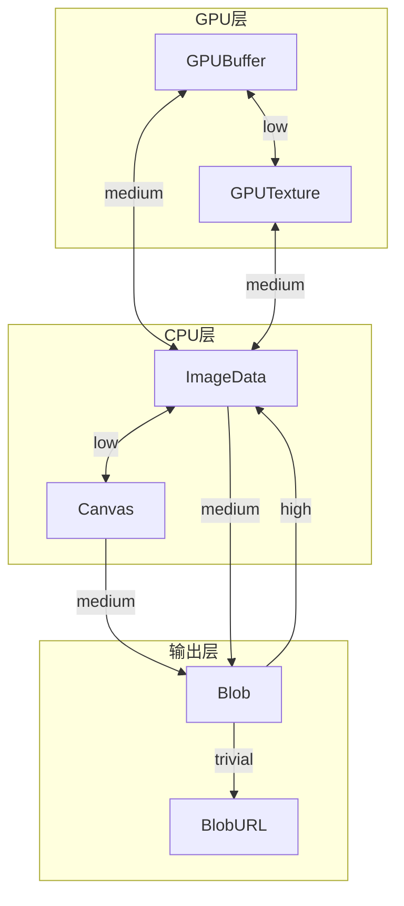
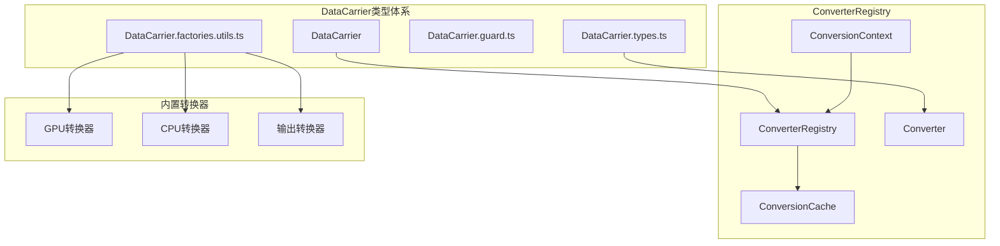

# ConverterRegistry 统一格式转换器架构设计

## 1. 概述

### 1.1 设计目标

本设计旨在创建一个统一的格式转换器注册表（ConverterRegistry），将分散在多个文件中的转换函数集中管理，实现：

1. **类型安全**：利用 TypeScript 泛型确保转换的类型正确性
2. **可扩展性**：支持注册自定义转换器
3. **性能优化**：内置缓存机制避免重复转换
4. **链式转换**：自动查找最优转换路径（A→B→C）

### 1.2 与 DataCarrier 类型体系的关系

本设计基于已完成的 [`DataCarrier`](demo/src/types/carrier/index.ts) 类型体系，使用其定义的：
- [`DataFormat`](demo/src/types/carrier/DataCarrier.types.ts:22) 类型枚举
- 各种 Carrier 类型（[`GPUBufferCarrier`](demo/src/types/carrier/DataCarrier.types.ts:172)、[`ImageDataCarrier`](demo/src/types/carrier/DataCarrier.types.ts:178) 等）
- 工厂函数（[`createGPUBufferCarrier`](demo/src/types/carrier/DataCarrier.factories.utils.ts:75) 等）

### 1.3 现有转换函数分析

| 函数 | 位置 | 转换方向 | 问题 |
|-----|------|---------|------|
| [`gpuBufferToImageData()`](demo/src/utils/webgpu/convert/gpuBufferToImageData.ts:4) | webgpu/convert | GPUBuffer/GPUTexture → ImageData | 支持两种输入类型 |
| [`imageDataToGPUBuffer()`](demo/src/processPipelines/imageProcessor.utils.ts:8) | imageProcessor.utils | ImageData → GPUBuffer | 独立位置 |
| [`gpuBufferToCanvas()`](demo/src/processPipelines/nodes/watermarkNode.utils.ts:24) | watermarkNode.utils | GPUBuffer → Canvas | 重复实现 |
| [`canvasToGpuBuffer()`](demo/src/processPipelines/nodes/watermarkNode.utils.ts:53) | watermarkNode.utils | Canvas → GPUBuffer | 重复实现 |

## 2. 核心接口设计

### 2.1 ConversionContext 上下文接口

```typescript
/**
 * 转换上下文接口
 * 提供转换过程中所需的资源和配置
 */
interface ConversionContext {
  /** WebGPU 设备实例 - GPU 相关转换必需 */
  readonly device: GPUDevice
  
  /** 转换缓存 - 用于避免重复转换 */
  readonly cache: ConversionCache
  
  /** 性能监控选项 */
  readonly performanceOptions?: PerformanceOptions
  
  /** 取消信号 - 支持中断长时间转换 */
  readonly signal?: AbortSignal
}

/**
 * 转换缓存接口
 * 使用 WeakMap 避免内存泄漏
 */
interface ConversionCache {
  /** 获取缓存的转换结果 */
  get<TTo extends DataFormat>(
    source: AnyDataCarrier,
    targetFormat: TTo
  ): CarrierOfFormat<TTo> | undefined
  
  /** 设置缓存 */
  set<TTo extends DataFormat>(
    source: AnyDataCarrier,
    targetFormat: TTo,
    result: CarrierOfFormat<TTo>
  ): void
  
  /** 检查是否存在缓存 */
  has(source: AnyDataCarrier, targetFormat: DataFormat): boolean
  
  /** 清除指定源的所有缓存 */
  invalidate(source: AnyDataCarrier): void
  
  /** 清除所有缓存 */
  clear(): void
}

/**
 * 性能监控选项
 */
interface PerformanceOptions {
  /** 是否启用性能计时 */
  enableTiming?: boolean
  
  /** 性能回调函数 */
  onMetrics?: (metrics: ConversionMetrics) => void
  
  /** 是否记录转换历史 */
  recordHistory?: boolean
}

/**
 * 转换性能指标
 */
interface ConversionMetrics {
  /** 源格式 */
  fromFormat: DataFormat
  
  /** 目标格式 */
  toFormat: DataFormat
  
  /** 转换耗时（毫秒） */
  duration: number
  
  /** 数据大小（字节） */
  dataSize: number
  
  /** 是否命中缓存 */
  cacheHit: boolean
  
  /** 转换路径（链式转换时） */
  path?: DataFormat[]
}
```

### 2.2 Converter 转换器接口

```typescript
/**
 * 转换器元数据
 * 描述转换器的能力和特性
 */
interface ConverterMetadata {
  /** 转换器名称 */
  readonly name: string
  
  /** 转换器描述 */
  readonly description?: string
  
  /** 是否为异步转换 */
  readonly isAsync: true
  
  /** 预估的性能开销等级 */
  readonly costLevel: ConversionCostLevel
  
  /** 是否需要 GPU 设备 */
  readonly requiresGPU: boolean
}

/**
 * 转换开销等级
 * 用于路径优化时选择最优转换路径
 */
type ConversionCostLevel = 
  | 'trivial'    // 几乎无开销（如类型包装）
  | 'low'        // 低开销（纯 CPU 内存操作）
  | 'medium'     // 中等开销（GPU↔CPU 传输）
  | 'high'       // 高开销（涉及编解码）

/**
 * 转换器接口
 * 定义从一种格式到另一种格式的转换能力
 */
interface Converter<
  TFrom extends DataFormat = DataFormat,
  TTo extends DataFormat = DataFormat
> {
  /** 源格式 */
  readonly fromFormat: TFrom
  
  /** 目标格式 */
  readonly toFormat: TTo
  
  /** 转换器元数据 */
  readonly metadata: ConverterMetadata
  
  /**
   * 执行转换
   * @param source 源数据载体
   * @param context 转换上下文
   * @returns 转换后的数据载体
   */
  convert(
    source: CarrierOfFormat<TFrom>,
    context: ConversionContext
  ): Promise<CarrierOfFormat<TTo>>
  
  /**
   * 检查是否可以执行转换
   * 用于运行时验证（如检查 GPU 设备是否可用）
   */
  canConvert?(context: ConversionContext): boolean
}

/**
 * 类型映射：DataFormat → Carrier 类型
 */
type CarrierOfFormat<T extends DataFormat> =
  T extends 'GPUBuffer' ? GPUBufferCarrier :
  T extends 'GPUTexture' ? GPUTextureCarrier :
  T extends 'ImageData' ? ImageDataCarrier :
  T extends 'Canvas' ? CanvasCarrier :
  T extends 'Blob' ? BlobCarrier :
  T extends 'BlobURL' ? BlobURLCarrier :
  never
```

### 2.3 ConverterRegistry 注册表接口

```typescript
/**
 * 转换路径信息
 * 描述从源格式到目标格式的转换路径
 */
interface ConversionPath {
  /** 转换路径中的格式序列 */
  readonly formats: DataFormat[]
  
  /** 路径中的转换器序列 */
  readonly converters: Converter[]
  
  /** 总开销等级 */
  readonly totalCost: number
  
  /** 是否为直接转换（无中间步骤） */
  readonly isDirect: boolean
}

/**
 * 注册表配置选项
 */
interface ConverterRegistryOptions {
  /** 最大链式转换深度，默认为 3 */
  maxChainDepth?: number
  
  /** 是否启用缓存，默认为 true */
  enableCache?: boolean
  
  /** 缓存策略 */
  cacheStrategy?: CacheStrategy
  
  /** 是否在注册时验证转换器 */
  validateOnRegister?: boolean
}

/**
 * 缓存策略
 */
type CacheStrategy =
  | 'none'           // 不缓存
  | 'source-based'   // 基于源对象缓存
  | 'content-hash'   // 基于内容哈希缓存（更精确但开销更大）

/**
 * 转换器注册表接口
 * 管理所有转换器的注册、查找和执行
 */
interface ConverterRegistry {
  /**
   * 注册转换器
   * @param converter 要注册的转换器
   * @throws 如果已存在相同源/目标格式的转换器
   */
  register<TFrom extends DataFormat, TTo extends DataFormat>(
    converter: Converter<TFrom, TTo>
  ): void
  
  /**
   * 注销转换器
   * @param fromFormat 源格式
   * @param toFormat 目标格式
   * @returns 是否成功注销
   */
  unregister(fromFormat: DataFormat, toFormat: DataFormat): boolean
  
  /**
   * 检查是否存在从源格式到目标格式的转换路径
   * @param fromFormat 源格式
   * @param toFormat 目标格式
   * @returns 是否可转换
   */
  canConvert(fromFormat: DataFormat, toFormat: DataFormat): boolean
  
  /**
   * 获取转换路径
   * @param fromFormat 源格式
   * @param toFormat 目标格式
   * @returns 转换路径，如果不存在则返回 null
   */
  getPath(fromFormat: DataFormat, toFormat: DataFormat): ConversionPath | null
  
  /**
   * 执行转换
   * @param source 源数据载体
   * @param toFormat 目标格式
   * @param context 转换上下文
   * @returns 转换后的数据载体
   */
  convert<TTo extends DataFormat>(
    source: AnyDataCarrier,
    toFormat: TTo,
    context: ConversionContext
  ): Promise<CarrierOfFormat<TTo>>
  
  /**
   * 获取所有已注册的转换器
   */
  getRegisteredConverters(): ReadonlyArray<Converter>
  
  /**
   * 获取指定格式可转换到的所有目标格式
   */
  getConvertibleFormats(fromFormat: DataFormat): DataFormat[]
  
  /**
   * 清除所有缓存
   */
  clearCache(): void
}
```

## 3. 内置转换器设计

### 3.1 转换器关系图



### 3.2 内置转换器列表

| 转换器名称 | 源格式 | 目标格式 | 开销等级 | 需要GPU | 说明 |
|-----------|--------|---------|---------|---------|------|
| `GPUBufferToImageData` | GPUBuffer | ImageData | medium | ✓ | GPU→CPU 数据传输 |
| `ImageDataToGPUBuffer` | ImageData | GPUBuffer | medium | ✓ | CPU→GPU 数据传输 |
| `GPUTextureToImageData` | GPUTexture | ImageData | medium | ✓ | 纹理读回 CPU |
| `ImageDataToGPUTexture` | ImageData | GPUTexture | medium | ✓ | 上传纹理到 GPU |
| `GPUBufferToGPUTexture` | GPUBuffer | GPUTexture | low | ✓ | GPU 内部转换 |
| `GPUTextureToGPUBuffer` | GPUTexture | GPUBuffer | low | ✓ | GPU 内部转换 |
| `CanvasToImageData` | Canvas | ImageData | low | ✗ | 2D 上下文读取 |
| `ImageDataToCanvas` | ImageData | Canvas | low | ✗ | 2D 上下文绘制 |
| `ImageDataToBlob` | ImageData | Blob | medium | ✗ | 图像编码 |
| `CanvasToBlob` | Canvas | Blob | medium | ✗ | Canvas 导出 |
| `BlobToImageData` | Blob | ImageData | high | ✗ | 图像解码 |
| `BlobToBlobURL` | Blob | BlobURL | trivial | ✗ | URL 创建 |

### 3.3 核心转换器实现示例

#### 3.3.1 GPUBufferToImageData 转换器

```typescript
/**
 * GPUBuffer → ImageData 转换器
 * 基于现有 gpuBufferToImageData 函数封装
 */
const GPUBufferToImageDataConverter: Converter<'GPUBuffer', 'ImageData'> = {
  fromFormat: 'GPUBuffer',
  toFormat: 'ImageData',
  
  metadata: {
    name: 'GPUBufferToImageData',
    description: '将 GPU 缓冲区数据传输到 CPU ImageData',
    isAsync: true,
    costLevel: 'medium',
    requiresGPU: true
  },
  
  async convert(
    source: GPUBufferCarrier,
    context: ConversionContext
  ): Promise<ImageDataCarrier> {
    const { device } = context
    const { buffer, width, height } = source.state
    
    // 创建 staging buffer 用于读取
    const size = width * height * 4
    const stagingBuffer = device.createBuffer({
      size,
      usage: GPUBufferUsage.COPY_DST | GPUBufferUsage.MAP_READ
    })
    
    // 复制数据到 staging buffer
    const commandEncoder = device.createCommandEncoder()
    commandEncoder.copyBufferToBuffer(buffer, 0, stagingBuffer, 0, size)
    device.queue.submit([commandEncoder.finish()])
    
    // 读取数据
    await stagingBuffer.mapAsync(GPUMapMode.READ)
    const data = new Uint8ClampedArray(
      stagingBuffer.getMappedRange().slice(0)
    )
    stagingBuffer.unmap()
    stagingBuffer.destroy()
    
    // 创建 ImageData 载体
    const imageData = new ImageData(data, width, height)
    return createImageDataCarrier(imageData)
  },
  
  canConvert(context: ConversionContext): boolean {
    return context.device !== undefined
  }
}
```

#### 3.3.2 ImageDataToGPUBuffer 转换器

```typescript
/**
 * ImageData → GPUBuffer 转换器
 */
const ImageDataToGPUBufferConverter: Converter<'ImageData', 'GPUBuffer'> = {
  fromFormat: 'ImageData',
  toFormat: 'GPUBuffer',
  
  metadata: {
    name: 'ImageDataToGPUBuffer',
    description: '将 CPU ImageData 上传到 GPU 缓冲区',
    isAsync: true,
    costLevel: 'medium',
    requiresGPU: true
  },
  
  async convert(
    source: ImageDataCarrier,
    context: ConversionContext
  ): Promise<GPUBufferCarrier> {
    const { device } = context
    const { imageData } = source.state
    
    const buffer = device.createBuffer({
      size: imageData.data.byteLength,
      usage: GPUBufferUsage.STORAGE |
             GPUBufferUsage.COPY_SRC |
             GPUBufferUsage.COPY_DST,
      mappedAtCreation: true
    })
    
    new Uint8Array(buffer.getMappedRange()).set(imageData.data)
    buffer.unmap()
    
    return createGPUBufferCarrier({
      buffer,
      width: imageData.width,
      height: imageData.height
    })
  }
}
```

## 4. 路径查找算法

### 4.1 算法概述

ConverterRegistry 使用 **Dijkstra 最短路径算法** 的变体来查找最优转换路径，以开销等级作为边权重。

### 4.2 开销权重映射

```typescript
/** 开销等级到数值权重的映射 */
const COST_WEIGHTS: Record<ConversionCostLevel, number> = {
  trivial: 1,
  low: 2,
  medium: 4,
  high: 8
}
```

### 4.3 路径查找伪代码

```typescript
/**
 * 查找从源格式到目标格式的最优转换路径
 * 使用 BFS + 优先队列实现
 */
function findOptimalPath(
  fromFormat: DataFormat,
  toFormat: DataFormat,
  converters: Map<string, Converter>,
  maxDepth: number
): ConversionPath | null {
  // 如果源和目标相同，返回空路径
  if (fromFormat === toFormat) {
    return { formats: [fromFormat], converters: [], totalCost: 0, isDirect: true }
  }
  
  // 检查是否存在直接转换器
  const directKey = `${fromFormat}->${toFormat}`
  if (converters.has(directKey)) {
    const converter = converters.get(directKey)!
    return {
      formats: [fromFormat, toFormat],
      converters: [converter],
      totalCost: COST_WEIGHTS[converter.metadata.costLevel],
      isDirect: true
    }
  }
  
  // 使用优先队列进行 BFS
  const queue = new PriorityQueue<PathNode>()
  const visited = new Set<DataFormat>()
  
  queue.enqueue({
    format: fromFormat,
    path: [fromFormat],
    converters: [],
    cost: 0
  }, 0)
  
  while (!queue.isEmpty()) {
    const current = queue.dequeue()!
    
    if (current.path.length > maxDepth + 1) continue
    if (visited.has(current.format)) continue
    visited.add(current.format)
    
    // 获取当前格式可转换到的所有目标
    for (const [key, converter] of converters) {
      if (!key.startsWith(`${current.format}->`)) continue
      
      const nextFormat = converter.toFormat
      if (visited.has(nextFormat)) continue
      
      const newCost = current.cost + COST_WEIGHTS[converter.metadata.costLevel]
      const newPath = [...current.path, nextFormat]
      const newConverters = [...current.converters, converter]
      
      // 找到目标
      if (nextFormat === toFormat) {
        return {
          formats: newPath,
          converters: newConverters,
          totalCost: newCost,
          isDirect: newPath.length === 2
        }
      }
      
      queue.enqueue({
        format: nextFormat,
        path: newPath,
        converters: newConverters,
        cost: newCost
      }, newCost)
    }
  }
  
  return null // 无法找到转换路径
}
```

## 5. 缓存策略设计

### 5.1 缓存实现

```typescript
/**
 * 基于 WeakMap 的转换缓存实现
 * 当源对象被 GC 回收时，缓存自动清除
 */
class ConversionCacheImpl implements ConversionCache {
  /** 缓存存储：source -> Map<targetFormat, result> */
  private readonly cache = new WeakMap<object, Map<DataFormat, AnyDataCarrier>>()
  
  get<TTo extends DataFormat>(
    source: AnyDataCarrier,
    targetFormat: TTo
  ): CarrierOfFormat<TTo> | undefined {
    const sourceKey = this.getSourceKey(source)
    const formatCache = this.cache.get(sourceKey)
    return formatCache?.get(targetFormat) as CarrierOfFormat<TTo> | undefined
  }
  
  set<TTo extends DataFormat>(
    source: AnyDataCarrier,
    targetFormat: TTo,
    result: CarrierOfFormat<TTo>
  ): void {
    const sourceKey = this.getSourceKey(source)
    let formatCache = this.cache.get(sourceKey)
    
    if (!formatCache) {
      formatCache = new Map()
      this.cache.set(sourceKey, formatCache)
    }
    
    formatCache.set(targetFormat, result)
  }
  
  has(source: AnyDataCarrier, targetFormat: DataFormat): boolean {
    const sourceKey = this.getSourceKey(source)
    return this.cache.get(sourceKey)?.has(targetFormat) ?? false
  }
  
  invalidate(source: AnyDataCarrier): void {
    const sourceKey = this.getSourceKey(source)
    this.cache.delete(sourceKey)
  }
  
  clear(): void {
    // WeakMap 无法遍历，需要维护额外的引用列表
    // 或者创建新实例
  }
  
  /** 获取源对象的缓存键 */
  private getSourceKey(source: AnyDataCarrier): object {
    // 使用 state 对象作为键，因为它包含实际数据引用
    return source.state
  }
}
```

### 5.2 缓存失效策略

| 场景 | 策略 |
|-----|------|
| 源数据被销毁 | WeakMap 自动清除 |
| 源数据被修改 | 调用 `invalidate()` |
| 内存压力 | 调用 `clear()` |
| 转换器更新 | 清除相关格式的缓存 |

## 6. 文件结构设计

### 6.1 目录结构

```
demo/src/types/converter/
├── index.ts                      # 统一导出
├── imports.ts                    # 内部导入
├── ConversionContext.types.ts    # 上下文接口定义
├── Converter.types.ts            # 转换器接口定义
├── ConverterRegistry.types.ts    # 注册表接口定义
├── ConverterRegistry.class.ts    # 注册表实现
├── ConversionCache.class.ts      # 缓存实现
├── pathFinder.utils.ts           # 路径查找算法
└── converters/                   # 内置转换器
    ├── index.ts                  # 转换器导出
    ├── gpu/
    │   ├── GPUBufferToImageData.ts
    │   ├── ImageDataToGPUBuffer.ts
    │   ├── GPUTextureToImageData.ts
    │   ├── ImageDataToGPUTexture.ts
    │   ├── GPUBufferToGPUTexture.ts
    │   └── GPUTextureToGPUBuffer.ts
    ├── cpu/
    │   ├── CanvasToImageData.ts
    │   └── ImageDataToCanvas.ts
    └── output/
        ├── ImageDataToBlob.ts
        ├── CanvasToBlob.ts
        ├── BlobToImageData.ts
        └── BlobToBlobURL.ts
```

### 6.2 模块导出设计

```typescript
// demo/src/types/converter/index.ts

// 类型导出
export type {
  ConversionContext,
  ConversionCache,
  PerformanceOptions,
  ConversionMetrics
} from './ConversionContext.types'

export type {
  Converter,
  ConverterMetadata,
  ConversionCostLevel,
  CarrierOfFormat
} from './Converter.types'

export type {
  ConverterRegistry,
  ConverterRegistryOptions,
  ConversionPath,
  CacheStrategy
} from './ConverterRegistry.types'

// 实现导出
export { ConverterRegistryImpl } from './ConverterRegistry.class'
export { ConversionCacheImpl } from './ConversionCache.class'

// 工厂函数
export { createConverterRegistry } from './ConverterRegistry.class'
export { createConversionContext } from './ConversionContext.types'

// 内置转换器
export { builtinConverters } from './converters'
```

## 7. 与 DataCarrier 类型体系的集成

### 7.1 集成架构图



### 7.2 使用示例

```typescript
import {
  createConverterRegistry,
  createConversionContext,
  builtinConverters
} from '@/types/converter'
import {
  createGPUBufferCarrier,
  type GPUBufferCarrier,
  type ImageDataCarrier
} from '@/types/carrier'

// 1. 创建注册表并注册内置转换器
const registry = createConverterRegistry({
  maxChainDepth: 3,
  enableCache: true,
  cacheStrategy: 'source-based'
})

// 注册所有内置转换器
builtinConverters.forEach(converter => registry.register(converter))

// 2. 创建转换上下文
const context = createConversionContext({
  device: gpuDevice,
  performanceOptions: {
    enableTiming: true,
    onMetrics: (metrics) => console.log('转换耗时:', metrics.duration)
  }
})

// 3. 执行转换
async function processImage(gpuBuffer: GPUBufferCarrier): Promise<void> {
  // 直接转换：GPUBuffer → ImageData
  const imageData = await registry.convert(gpuBuffer, 'ImageData', context)
  
  // 链式转换：GPUBuffer → ImageData → Blob → BlobURL
  const blobUrl = await registry.convert(gpuBuffer, 'BlobURL', context)
  
  // 检查转换路径
  const path = registry.getPath('GPUBuffer', 'BlobURL')
  console.log('转换路径:', path?.formats)
  // 输出: ['GPUBuffer', 'ImageData', 'Blob', 'BlobURL']
}
```

### 7.3 与现有代码的兼容适配

```typescript
/**
 * 兼容适配器：将旧版转换函数包装为 Converter
 * 用于渐进式迁移
 */
function wrapLegacyConverter<TFrom extends DataFormat, TTo extends DataFormat>(
  fromFormat: TFrom,
  toFormat: TTo,
  legacyFn: (source: any, device: GPUDevice) => Promise<any>,
  metadata: Partial<ConverterMetadata>
): Converter<TFrom, TTo> {
  return {
    fromFormat,
    toFormat,
    metadata: {
      name: `Legacy_${fromFormat}To${toFormat}`,
      isAsync: true,
      costLevel: 'medium',
      requiresGPU: true,
      ...metadata
    },
    async convert(source, context) {
      const result = await legacyFn(source, context.device)
      // 根据目标格式创建对应的 Carrier
      return createCarrierFromLegacy(toFormat, result)
    }
  }
}

// 使用示例：包装现有的 gpuBufferToImageData
const wrappedConverter = wrapLegacyConverter(
  'GPUBuffer',
  'ImageData',
  async (source: GPUBufferCarrier, device: GPUDevice) => {
    return gpuBufferToImageData(
      source.state.buffer,
      source.state.width,
      source.state.height,
      device
    )
  },
  { name: 'GPUBufferToImageData' }
)
```

## 8. 迁移策略

### 8.1 迁移步骤


### 8.2 需要迁移的现有代码

| 文件 | 函数 | 迁移方式 |
|-----|------|---------|
| [`gpuBufferToImageData.ts`](demo/src/utils/webgpu/convert/gpuBufferToImageData.ts:4) | `gpuBufferToImageData()` | 重构为 `GPUBufferToImageData` 转换器 |
| [`imageProcessor.utils.ts`](demo/src/processPipelines/imageProcessor.utils.ts:8) | `imageDataToGPUBuffer()` | 重构为 `ImageDataToGPUBuffer` 转换器 |
| [`watermarkNode.utils.ts`](demo/src/processPipelines/nodes/watermarkNode.utils.ts:24) | `gpuBufferToCanvas()` | 删除，使用链式转换 GPUBuffer→ImageData→Canvas |
| [`watermarkNode.utils.ts`](demo/src/processPipelines/nodes/watermarkNode.utils.ts:53) | `canvasToGpuBuffer()` | 删除，使用链式转换 Canvas→ImageData→GPUBuffer |
| [`formatConverter.ts`](demo/src/processPipelines/nodes/formatConverter.ts:13) | `转换为ImageData()` | 使用 `registry.convert()` 替代 |
| [`formatConverter.ts`](demo/src/processPipelines/nodes/formatConverter.ts:23) | `转换为PipelineData()` | 使用 `registry.convert()` 替代 |

## 9. 总结

### 9.1 设计要点

| 方面 | 设计决策 | 理由 |
|-----|---------|------|
| **类型安全** | 使用泛型 `Converter<TFrom, TTo>` | 编译时类型检查，避免运行时错误 |
| **缓存策略** | 基于 WeakMap 的源对象缓存 | 自动内存管理，避免内存泄漏 |
| **路径查找** | Dijkstra 变体算法 | 保证找到最优转换路径 |
| **可扩展性** | 注册表模式 | 支持自定义转换器，便于扩展 |
| **性能监控** | 可选的 metrics 回调 | 生产环境可关闭，开发时可启用 |

### 9.2 与现有架构的兼容性

- ✅ 完全兼容 [`DataCarrier`](demo/src/types/carrier/index.ts) 类型体系
- ✅ 支持渐进式迁移，可包装现有转换函数
- ✅ 不破坏现有 API，可并行使用

### 9.3 预期收益

1. **代码复用**：消除重复的转换函数实现
2. **类型安全**：编译时检查转换类型正确性
3. **性能优化**：缓存机制避免重复转换
4. **可维护性**：集中管理所有转换逻辑
5. **可扩展性**：轻松添加新的数据格式和转换器

### 9.4 实施建议

1. **优先级**：先实现核心接口和 GPU↔ImageData 转换器
2. **测试**：为每个转换器编写单元测试
3. **文档**：为每个转换器添加 JSDoc 注释
4. **性能**：在关键路径上进行性能基准测试
