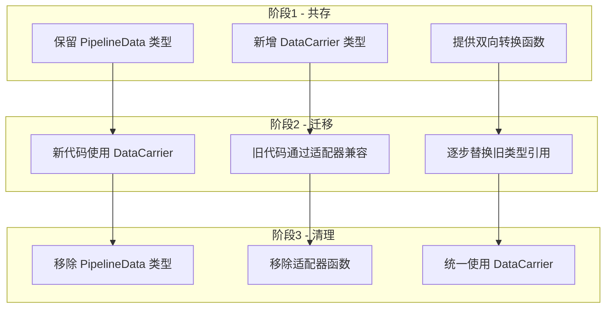
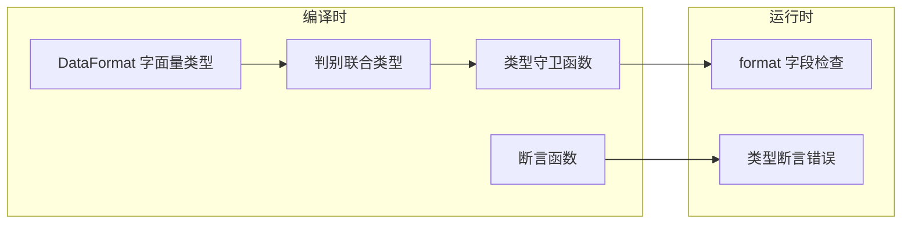

# DataCarrier 类型体系设计文档

## 1. 设计背景

### 1.1 现有问题

根据 [`统一高性能流水线接口架构分析.md`](统一高性能流水线接口架构分析.md) 的分析，当前 [`PipelineData.type.ts`](../demo/src/types/PipelineData.type.ts) 存在以下问题：

```typescript
// 当前定义 - 问题代码
export interface PipelineData {
    buffer: GPUBuffer | GPUTexture;  // 联合类型导致运行时需要类型检查
    width: number;
    height: number;
}
```

**主要问题**：
1. `GPUBuffer | GPUTexture` 联合类型无法在编译时区分具体类型
2. 缺少资源销毁机制，可能导致 GPU 资源泄漏
3. 不支持其他数据格式（ImageData、Canvas、Blob 等）
4. 格式转换函数分散在多个文件中

### 1.2 设计目标

1. 创建统一的 `DataCarrier` 接口，包含 `width`、`height`、`format`、`destroy()` 方法
2. 设计 `DataFormat` 类型枚举
3. 设计具体载体类型，每种类型携带特定的数据
4. 提供类型守卫函数，实现编译时类型安全
5. 保持与现有 `PipelineData` 的兼容性

## 2. 类型定义设计

### 2.1 DataFormat 类型

```typescript
/**
 * 数据格式类型
 * 用于标识 DataCarrier 中携带的数据类型
 */
export type DataFormat =
  | 'GPUBuffer'      // GPU 缓冲区 - 用于 GPU 计算
  | 'GPUTexture'     // GPU 纹理 - 用于纹理采样和渲染
  | 'ImageData'      // CPU ImageData - 用于 CPU 处理
  | 'Canvas'         // Canvas 元素 - 用于 2D 绑定和显示
  | 'Blob'           // Blob 对象 - 用于文件导出
  | 'BlobURL'        // Blob URL 字符串 - 用于图像显示和下载
```

### 2.2 DataCarrier 基础接口

```typescript
/**
 * 数据载体基础接口
 * 所有具体载体类型都必须实现此接口
 */
export interface DataCarrier<TFormat extends DataFormat = DataFormat> {
  /** 数据宽度（像素） */
  readonly width: number
  
  /** 数据高度（像素） */
  readonly height: number
  
  /** 数据格式标识符 */
  readonly format: TFormat
  
  /**
   * 销毁载体，释放相关资源
   * 对于 GPU 资源，会调用 destroy() 方法
   * 对于 BlobURL，会调用 URL.revokeObjectURL()
   */
  destroy(): void
}
```

### 2.3 具体载体类型定义

#### 2.3.1 GPUBufferCarrier

```typescript
/**
 * GPU 缓冲区载体
 * 用于 GPU 计算着色器处理
 */
export interface GPUBufferCarrier extends DataCarrier<'GPUBuffer'> {
  readonly format: 'GPUBuffer'
  
  /** GPU 缓冲区对象 */
  readonly buffer: GPUBuffer
  
  /** 
   * 缓冲区用途标志
   * 通常为 GPUBufferUsage.STORAGE | GPUBufferUsage.COPY_SRC | GPUBufferUsage.COPY_DST
   */
  readonly usage: GPUBufferUsageFlags
  
  /**
   * 每像素字节数
   * RGBA 格式为 4，用于计算缓冲区大小
   */
  readonly bytesPerPixel: number
}
```

#### 2.3.2 GPUTextureCarrier

```typescript
/**
 * GPU 纹理载体
 * 用于纹理采样和渲染管线
 */
export interface GPUTextureCarrier extends DataCarrier<'GPUTexture'> {
  readonly format: 'GPUTexture'
  
  /** GPU 纹理对象 */
  readonly texture: GPUTexture
  
  /** 
   * 纹理格式
   * 如 'rgba8unorm', 'bgra8unorm', 'rgba16float' 等
   */
  readonly textureFormat: GPUTextureFormat
  
  /**
   * 纹理用途标志
   * 通常为 GPUTextureUsage.TEXTURE_BINDING | GPUTextureUsage.COPY_SRC | GPUTextureUsage.RENDER_ATTACHMENT
   */
  readonly usage: GPUTextureUsageFlags
}
```

#### 2.3.3 ImageDataCarrier

```typescript
/**
 * ImageData 载体
 * 用于 CPU 端图像处理
 */
export interface ImageDataCarrier extends DataCarrier<'ImageData'> {
  readonly format: 'ImageData'
  
  /** ImageData 对象 */
  readonly imageData: ImageData
}
```

#### 2.3.4 CanvasCarrier

```typescript
/**
 * Canvas 载体
 * 用于 2D 渲染和显示
 */
export interface CanvasCarrier extends DataCarrier<'Canvas'> {
  readonly format: 'Canvas'
  
  /** 
   * Canvas 元素
   * 可以是 HTMLCanvasElement 或 OffscreenCanvas
   */
  readonly canvas: HTMLCanvasElement | OffscreenCanvas
  
  /**
   * 2D 渲染上下文
   * 可选，用于直接绑定操作
   */
  readonly context?: CanvasRenderingContext2D | OffscreenCanvasRenderingContext2D
}
```

#### 2.3.5 BlobCarrier

```typescript
/**
 * Blob 载体
 * 用于文件导出
 */
export interface BlobCarrier extends DataCarrier<'Blob'> {
  readonly format: 'Blob'
  
  /** Blob 对象 */
  readonly blob: Blob
  
  /** 
   * MIME 类型
   * 如 'image/png', 'image/jpeg', 'image/webp'
   */
  readonly mimeType: string
}
```

#### 2.3.6 BlobURLCarrier

```typescript
/**
 * Blob URL 载体
 * 用于图像显示和下载
 */
export interface BlobURLCarrier extends DataCarrier<'BlobURL'> {
  readonly format: 'BlobURL'
  
  /** Blob URL 字符串 */
  readonly url: string
  
  /** 
   * MIME 类型
   * 如 'image/png', 'image/jpeg', 'image/webp'
   */
  readonly mimeType: string
}
```

### 2.4 联合类型定义

```typescript
/**
 * 所有载体类型的联合
 */
export type AnyDataCarrier =
  | GPUBufferCarrier
  | GPUTextureCarrier
  | ImageDataCarrier
  | CanvasCarrier
  | BlobCarrier
  | BlobURLCarrier

/**
 * GPU 相关载体类型联合
 * 用于 GPU 管线处理
 */
export type GPUCarrier = GPUBufferCarrier | GPUTextureCarrier

/**
 * CPU 相关载体类型联合
 * 用于 CPU 处理
 */
export type CPUCarrier = ImageDataCarrier | CanvasCarrier

/**
 * 输出相关载体类型联合
 * 用于导出和显示
 */
export type OutputCarrier = BlobCarrier | BlobURLCarrier

/**
 * 管线载体类型
 * 用于管线处理的主要类型
 */
export type PipelineCarrier = GPUBufferCarrier | GPUTextureCarrier
```

## 3. 类型守卫函数设计

### 3.1 基础类型守卫

```typescript
/**
 * 检查是否为 GPUBufferCarrier
 */
export function isGPUBufferCarrier(carrier: AnyDataCarrier): carrier is GPUBufferCarrier {
  return carrier.format === 'GPUBuffer'
}

/**
 * 检查是否为 GPUTextureCarrier
 */
export function isGPUTextureCarrier(carrier: AnyDataCarrier): carrier is GPUTextureCarrier {
  return carrier.format === 'GPUTexture'
}

/**
 * 检查是否为 ImageDataCarrier
 */
export function isImageDataCarrier(carrier: AnyDataCarrier): carrier is ImageDataCarrier {
  return carrier.format === 'ImageData'
}

/**
 * 检查是否为 CanvasCarrier
 */
export function isCanvasCarrier(carrier: AnyDataCarrier): carrier is CanvasCarrier {
  return carrier.format === 'Canvas'
}

/**
 * 检查是否为 BlobCarrier
 */
export function isBlobCarrier(carrier: AnyDataCarrier): carrier is BlobCarrier {
  return carrier.format === 'Blob'
}

/**
 * 检查是否为 BlobURLCarrier
 */
export function isBlobURLCarrier(carrier: AnyDataCarrier): carrier is BlobURLCarrier {
  return carrier.format === 'BlobURL'
}
```

### 3.2 组合类型守卫

```typescript
/**
 * 检查是否为 GPU 相关载体
 */
export function isGPUCarrier(carrier: AnyDataCarrier): carrier is GPUCarrier {
  return carrier.format === 'GPUBuffer' || carrier.format === 'GPUTexture'
}

/**
 * 检查是否为 CPU 相关载体
 */
export function isCPUCarrier(carrier: AnyDataCarrier): carrier is CPUCarrier {
  return carrier.format === 'ImageData' || carrier.format === 'Canvas'
}

/**
 * 检查是否为输出相关载体
 */
export function isOutputCarrier(carrier: AnyDataCarrier): carrier is OutputCarrier {
  return carrier.format === 'Blob' || carrier.format === 'BlobURL'
}

/**
 * 检查是否为管线载体
 */
export function isPipelineCarrier(carrier: AnyDataCarrier): carrier is PipelineCarrier {
  return carrier.format === 'GPUBuffer' || carrier.format === 'GPUTexture'
}
```

### 3.3 断言函数

```typescript
/**
 * 断言为 GPUBufferCarrier，否则抛出错误
 */
export function assertGPUBufferCarrier(
  carrier: AnyDataCarrier,
  message?: string
): asserts carrier is GPUBufferCarrier {
  if (!isGPUBufferCarrier(carrier)) {
    throw new TypeError(message ?? `Expected GPUBufferCarrier, got ${carrier.format}`)
  }
}

/**
 * 断言为 GPUTextureCarrier，否则抛出错误
 */
export function assertGPUTextureCarrier(
  carrier: AnyDataCarrier,
  message?: string
): asserts carrier is GPUTextureCarrier {
  if (!isGPUTextureCarrier(carrier)) {
    throw new TypeError(message ?? `Expected GPUTextureCarrier, got ${carrier.format}`)
  }
}

/**
 * 断言为 PipelineCarrier，否则抛出错误
 */
export function assertPipelineCarrier(
  carrier: AnyDataCarrier,
  message?: string
): asserts carrier is PipelineCarrier {
  if (!isPipelineCarrier(carrier)) {
    throw new TypeError(message ?? `Expected PipelineCarrier, got ${carrier.format}`)
  }
}
```

## 4. 工厂函数设计

### 4.1 GPUBufferCarrier 工厂

```typescript
/**
 * 创建 GPUBufferCarrier 的参数
 */
export interface CreateGPUBufferCarrierParams {
  buffer: GPUBuffer
  width: number
  height: number
  usage?: GPUBufferUsageFlags
  bytesPerPixel?: number
}

/**
 * 创建 GPUBufferCarrier
 */
export function createGPUBufferCarrier(
  params: CreateGPUBufferCarrierParams
): GPUBufferCarrier {
  const { buffer, width, height, usage, bytesPerPixel = 4 } = params
  
  return {
    format: 'GPUBuffer',
    buffer,
    width,
    height,
    usage: usage ?? buffer.usage,
    bytesPerPixel,
    destroy() {
      buffer.destroy()
    }
  }
}
```

### 4.2 GPUTextureCarrier 工厂

```typescript
/**
 * 创建 GPUTextureCarrier 的参数
 */
export interface CreateGPUTextureCarrierParams {
  texture: GPUTexture
  width: number
  height: number
  textureFormat?: GPUTextureFormat
  usage?: GPUTextureUsageFlags
}

/**
 * 创建 GPUTextureCarrier
 */
export function createGPUTextureCarrier(
  params: CreateGPUTextureCarrierParams
): GPUTextureCarrier {
  const { texture, width, height, textureFormat, usage } = params
  
  return {
    format: 'GPUTexture',
    texture,
    width,
    height,
    textureFormat: textureFormat ?? texture.format,
    usage: usage ?? texture.usage,
    destroy() {
      texture.destroy()
    }
  }
}
```

### 4.3 其他载体工厂

```typescript
/**
 * 创建 ImageDataCarrier
 */
export function createImageDataCarrier(imageData: ImageData): ImageDataCarrier {
  return {
    format: 'ImageData',
    imageData,
    width: imageData.width,
    height: imageData.height,
    destroy() {
      // ImageData 无需显式销毁，由 GC 处理
    }
  }
}

/**
 * 创建 CanvasCarrier
 */
export function createCanvasCarrier(
  canvas: HTMLCanvasElement | OffscreenCanvas,
  context?: CanvasRenderingContext2D | OffscreenCanvasRenderingContext2D
): CanvasCarrier {
  return {
    format: 'Canvas',
    canvas,
    context,
    width: canvas.width,
    height: canvas.height,
    destroy() {
      // Canvas 无需显式销毁，由 GC 处理
    }
  }
}

/**
 * 创建 BlobCarrier
 */
export function createBlobCarrier(
  blob: Blob,
  width: number,
  height: number,
  mimeType?: string
): BlobCarrier {
  return {
    format: 'Blob',
    blob,
    width,
    height,
    mimeType: mimeType ?? blob.type,
    destroy() {
      // Blob 无需显式销毁，由 GC 处理
    }
  }
}

/**
 * 创建 BlobURLCarrier
 */
export function createBlobURLCarrier(
  url: string,
  width: number,
  height: number,
  mimeType: string
): BlobURLCarrier {
  return {
    format: 'BlobURL',
    url,
    width,
    height,
    mimeType,
    destroy() {
      URL.revokeObjectURL(url)
    }
  }
}
```

## 5. 与现有 PipelineData 的兼容策略

### 5.1 现有类型回顾

当前 [`PipelineData.type.ts`](../demo/src/types/PipelineData.type.ts) 定义：

```typescript
// 现有定义
export interface PipelineData {
    buffer: GPUBuffer | GPUTexture;
    width: number;
    height: number;
}

export type PipelineDataMultiRecord = Record<string, PipelineData>
```

### 5.2 兼容性适配器

```typescript
/**
 * 从旧版 PipelineData 转换为 DataCarrier
 * 通过检测 buffer 类型来确定具体的 Carrier 类型
 */
export function fromPipelineData(data: PipelineData): GPUBufferCarrier | GPUTextureCarrier {
  const buffer = data.buffer
  
  // 检测是否为 GPUTexture（GPUTexture 有 createView 方法）
  if ('createView' in buffer && typeof buffer.createView === 'function') {
    return createGPUTextureCarrier({
      texture: buffer as GPUTexture,
      width: data.width,
      height: data.height
    })
  }
  
  // 否则为 GPUBuffer
  return createGPUBufferCarrier({
    buffer: buffer as GPUBuffer,
    width: data.width,
    height: data.height
  })
}

/**
 * 从 DataCarrier 转换为旧版 PipelineData
 * 仅支持 GPUBufferCarrier 和 GPUTextureCarrier
 */
export function toPipelineData(carrier: PipelineCarrier): PipelineData {
  if (isGPUBufferCarrier(carrier)) {
    return {
      buffer: carrier.buffer,
      width: carrier.width,
      height: carrier.height
    }
  }
  
  if (isGPUTextureCarrier(carrier)) {
    return {
      buffer: carrier.texture,
      width: carrier.width,
      height: carrier.height
    }
  }
  
  // TypeScript 会确保这里不会到达
  throw new TypeError(`Unsupported carrier format: ${(carrier as AnyDataCarrier).format}`)
}
```

### 5.3 多记录类型兼容

```typescript
/**
 * 新版多记录类型
 */
export type DataCarrierMultiRecord = Record<string, AnyDataCarrier>

/**
 * 管线多记录类型（仅包含 GPU 载体）
 */
export type PipelineCarrierMultiRecord = Record<string, PipelineCarrier>

/**
 * 从旧版 PipelineDataMultiRecord 转换
 */
export function fromPipelineDataMultiRecord(
  data: PipelineDataMultiRecord
): PipelineCarrierMultiRecord {
  const result: PipelineCarrierMultiRecord = {}
  
  for (const [key, value] of Object.entries(data)) {
    result[key] = fromPipelineData(value)
  }
  
  return result
}

/**
 * 转换为旧版 PipelineDataMultiRecord
 */
export function toPipelineDataMultiRecord(
  carriers: PipelineCarrierMultiRecord
): PipelineDataMultiRecord {
  const result: PipelineDataMultiRecord = {}
  
  for (const [key, value] of Object.entries(carriers)) {
    result[key] = toPipelineData(value)
  }
  
  return result
}
```

### 5.4 渐进式迁移策略



## 6. 文件结构设计

### 6.1 建议的文件组织

```
demo/src/types/
├── carrier/
│   ├── index.ts                    # 统一导出
│   ├── DataCarrier.types.ts        # 基础接口和类型定义
│   ├── DataCarrier.guards.ts       # 类型守卫函数
│   ├── DataCarrier.factories.ts    # 工厂函数
│   └── DataCarrier.compat.ts       # 兼容性适配器
├── PipelineData.type.ts            # 保留现有文件（阶段1-2）
└── imports.ts                      # 类型导入汇总
```

### 6.2 各文件职责

| 文件 | 职责 | 导出内容 |
|-----|------|---------|
| `DataCarrier.types.ts` | 类型定义 | `DataFormat`, `DataCarrier`, 各具体载体接口, 联合类型 |
| `DataCarrier.guards.ts` | 类型守卫 | `isGPUBufferCarrier()`, `isGPUTextureCarrier()` 等 |
| `DataCarrier.factories.ts` | 工厂函数 | `createGPUBufferCarrier()`, `createGPUTextureCarrier()` 等 |
| `DataCarrier.compat.ts` | 兼容适配 | `fromPipelineData()`, `toPipelineData()` 等 |
| `index.ts` | 统一导出 | 重新导出所有公共 API |

## 7. 使用示例

### 7.1 基本使用

```typescript
import {
  createGPUBufferCarrier,
  createGPUTextureCarrier,
  isGPUBufferCarrier,
  isGPUTextureCarrier,
  type PipelineCarrier
} from '@/types/carrier'

// 创建 GPUBuffer 载体
function processWithGPUBuffer(device: GPUDevice, width: number, height: number) {
  const buffer = device.createBuffer({
    size: width * height * 4,
    usage: GPUBufferUsage.STORAGE | GPUBufferUsage.COPY_SRC
  })
  
  return createGPUBufferCarrier({ buffer, width, height })
}

// 处理管线数据
function processCarrier(carrier: PipelineCarrier) {
  if (isGPUBufferCarrier(carrier)) {
    // TypeScript 知道这里是 GPUBufferCarrier
    console.log('Buffer size:', carrier.buffer.size)
    console.log('Bytes per pixel:', carrier.bytesPerPixel)
  } else if (isGPUTextureCarrier(carrier)) {
    // TypeScript 知道这里是 GPUTextureCarrier
    console.log('Texture format:', carrier.textureFormat)
    const view = carrier.texture.createView()
  }
}
```

### 7.2 与现有代码兼容

```typescript
import { fromPipelineData, toPipelineData } from '@/types/carrier'
import type { PipelineData } from '@/types/PipelineData.type'

// 旧代码返回 PipelineData
async function legacyProcess(): Promise<PipelineData> {
  // ... 旧实现
}

// 新代码使用 DataCarrier
async function newProcess() {
  const oldData = await legacyProcess()
  
  // 转换为新类型
  const carrier = fromPipelineData(oldData)
  
  // 使用新类型处理
  // ...
  
  // 如需传递给旧代码，转换回去
  const backToOld = toPipelineData(carrier)
}
```

### 7.3 资源管理

```typescript
import { createGPUBufferCarrier, type GPUBufferCarrier } from '@/types/carrier'

class ResourceManager {
  private carriers: GPUBufferCarrier[] = []
  
  createBuffer(device: GPUDevice, width: number, height: number): GPUBufferCarrier {
    const buffer = device.createBuffer({
      size: width * height * 4,
      usage: GPUBufferUsage.STORAGE | GPUBufferUsage.COPY_SRC
    })
    
    const carrier = createGPUBufferCarrier({ buffer, width, height })
    this.carriers.push(carrier)
    return carrier
  }
  
  // 统一销毁所有资源
  destroyAll() {
    for (const carrier of this.carriers) {
      carrier.destroy()
    }
    this.carriers = []
  }
}
```

## 8. 设计总结

### 8.1 核心设计决策

| 决策 | 理由 |
|-----|------|
| 使用 `format` 字段作为判别器 | 支持 TypeScript 的判别联合类型，实现编译时类型安全 |
| 所有属性使用 `readonly` | 防止意外修改，确保数据一致性 |
| 提供 `destroy()` 方法 | 统一资源管理，防止 GPU 资源泄漏 |
| 使用工厂函数而非类 | 更轻量，避免 `this` 绑定问题，便于函数式编程 |
| 提供兼容适配器 | 支持渐进式迁移，降低重构风险 |

### 8.2 类型安全保证



### 8.3 验收标准检查

| 验收标准 | 状态 | 说明 |
|---------|------|------|
| DataCarrier 接口包含 width、height、format、destroy | ✅ | 见 2.2 节 |
| 所有载体类型实现统一接口 | ✅ | 见 2.3 节，6 种载体类型 |
| 类型守卫函数提供编译时类型安全 | ✅ | 见 3.1-3.3 节 |
| 设计文档清晰，可直接用于 Code 模式实现 | ✅ | 完整代码示例 |
