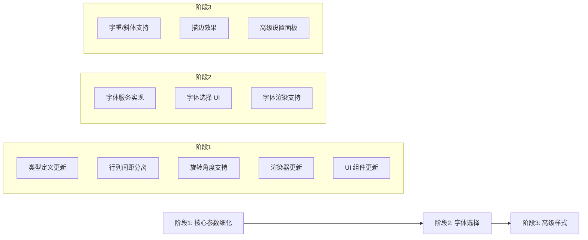

# 水印调节参数细化计划

## 1. 背景与目标

### 1.1 当前状态分析

现有水印模块位于 `demo/src/components/control-panels/watermark/` 目录，核心文件包括：

| 文件 | 职责 |
|------|------|
| [`watermark.types.ts`](demo/src/components/control-panels/watermark/watermark.types.ts) | 类型定义 |
| [`watermark.renderer.ts`](demo/src/components/control-panels/watermark/watermark.renderer.ts) | Canvas 渲染逻辑 |
| [`watermark.constants.ts`](demo/src/components/control-panels/watermark/watermark.constants.ts) | 默认配置与范围限制 |
| [`watermark.templates.ts`](demo/src/components/control-panels/watermark/watermark.templates.ts) | 字体样式生成 |
| [`WatermarkSettings.vue`](demo/src/components/control-panels/watermark/WatermarkSettings.vue) | 配置 UI 组件 |

**当前 `水印配置` 接口：**
```typescript
interface 水印配置 {
    样式: 水印样式        // 'grid' | 'center'
    文本: string
    字体大小: number
    不透明度: number
    网格间距: number      // 仅 grid 样式有效（行列共用）
    颜色: string
}
```

### 1.2 存在的问题

1. **间距控制粒度不足**：`网格间距` 同时控制行间距和列间距，无法独立调整
2. **字体选择缺失**：当前硬编码为 `Arial, sans-serif`，用户无法选择其他字体
3. **旋转角度固定**：网格水印固定 45 度旋转，无法自定义
4. **缺少高级参数**：如描边、阴影、字重等

### 1.3 细化目标

- 支持行间距和列间距独立调整
- 实现系统字体选择功能
- 增加旋转角度自定义
- 扩展其他可选参数

---

## 2. 类型定义更新方案

### 2.1 新增类型定义

在 [`watermark.types.ts`](demo/src/components/control-panels/watermark/watermark.types.ts) 中新增：

```typescript
/** 字体信息 */
export interface 字体信息 {
    family: string      // 字体族名称
    fullName: string    // 完整显示名称
    style?: string      // 字体样式（Regular, Bold 等）
}

/** 网格间距配置 */
export interface 网格间距配置 {
    行间距: number
    列间距: number
}

/** 文本样式配置 */
export interface 文本样式配置 {
    字重: number        // 100-900
    斜体: boolean
    描边宽度: number
    描边颜色: string
}
```

### 2.2 更新 `水印配置` 接口

```typescript
/** 水印配置 - 细化版 */
export interface 水印配置 {
    // 基础配置
    样式: 水印样式
    文本: string
    颜色: string
    不透明度: number
    
    // 字体配置
    字体大小: number
    字体: string              // 新增：字体族名称
    文本样式?: 文本样式配置    // 新增：可选的高级文本样式
    
    // 网格配置（仅 grid 样式）
    网格间距: 网格间距配置     // 修改：从 number 改为对象
    旋转角度: number          // 新增：自定义旋转角度（度）
    
    // 兼容性字段（过渡期保留）
    /** @deprecated 使用 网格间距.行间距 和 网格间距.列间距 替代 */
    _legacySpacing?: number
}
```

---

## 3. 系统字体获取方案

### 3.1 技术选型

浏览器获取系统字体有以下方案：

| 方案 | 优点 | 缺点 | 推荐度 |
|------|------|------|--------|
| **Local Font Access API** | 原生 API，获取完整字体列表 | 需要用户授权，兼容性有限 | ⭐⭐⭐⭐ |
| **预定义字体列表** | 无需权限，兼容性好 | 无法获取用户自定义字体 | ⭐⭐⭐ |
| **字体检测探测** | 无需权限 | 实现复杂，不可靠 | ⭐ |

**推荐方案**：优先使用 Local Font Access API，降级到预定义字体列表。

### 3.2 字体服务接口设计

新建 `watermark.fonts.ts` 文件：

```typescript
/** 字体服务接口 */
export interface FontService {
    /** 获取可用字体列表 */
    getAvailableFonts(): Promise<字体信息[]>
    
    /** 检查字体是否可用 */
    isFontAvailable(fontFamily: string): boolean
    
    /** 获取默认字体 */
    getDefaultFont(): string
}

/** 预定义的安全字体列表 */
export const SAFE_FONTS: 字体信息[] = [
    { family: 'Arial', fullName: 'Arial' },
    { family: 'Helvetica', fullName: 'Helvetica' },
    { family: 'Times New Roman', fullName: 'Times New Roman' },
    { family: 'Georgia', fullName: 'Georgia' },
    { family: 'Verdana', fullName: 'Verdana' },
    { family: 'Courier New', fullName: 'Courier New' },
    { family: 'Microsoft YaHei', fullName: '微软雅黑' },
    { family: 'SimHei', fullName: '黑体' },
    { family: 'SimSun', fullName: '宋体' },
    { family: 'KaiTi', fullName: '楷体' }
]
```

### 3.3 Local Font Access API 实现

```typescript
/** 使用 Local Font Access API 获取系统字体 */
async function getSystemFonts(): Promise<字体信息[]> {
    // 检查 API 可用性
    if (!('queryLocalFonts' in window)) {
        console.warn('Local Font Access API 不可用，使用预定义字体列表')
        return SAFE_FONTS
    }
    
    try {
        // 请求字体访问权限
        const fonts = await window.queryLocalFonts()
        
        // 去重并转换格式
        const fontMap = new Map<string, 字体信息>()
        for (const font of fonts) {
            if (!fontMap.has(font.family)) {
                fontMap.set(font.family, {
                    family: font.family,
                    fullName: font.fullName,
                    style: font.style
                })
            }
        }
        
        return Array.from(fontMap.values())
    } catch (error) {
        // 用户拒绝授权或其他错误
        console.warn('获取系统字体失败:', error)
        return SAFE_FONTS
    }
}
```

### 3.4 TypeScript 类型声明

需要添加 Local Font Access API 的类型声明：

```typescript
// watermark.fonts.d.ts
interface FontData {
    family: string
    fullName: string
    style: string
    postscriptName: string
}

interface Window {
    queryLocalFonts?: () => Promise<FontData[]>
}
```

---

## 4. 渲染器更新方案

### 4.1 更新 `生成字体样式` 函数

修改 [`watermark.templates.ts`](demo/src/components/control-panels/watermark/watermark.templates.ts)：

```typescript
/** 生成完整的字体样式字符串 */
export function 生成字体样式(config: {
    字体大小: number
    字体?: string
    文本样式?: 文本样式配置
}): string {
    const { 字体大小, 字体 = 'Arial', 文本样式 } = config
    
    const parts: string[] = []
    
    // 字体样式（斜体）
    if (文本样式?.斜体) {
        parts.push('italic')
    }
    
    // 字重
    if (文本样式?.字重) {
        parts.push(String(文本样式.字重))
    }
    
    // 字体大小
    parts.push(`${字体大小}px`)
    
    // 字体族（带回退）
    parts.push(`"${字体}", Arial, sans-serif`)
    
    return parts.join(' ')
}
```

### 4.2 更新网格水印渲染逻辑

修改 [`watermark.renderer.ts`](demo/src/components/control-panels/watermark/watermark.renderer.ts) 中的 `渲染网格水印` 函数：

```typescript
function 渲染网格水印(renderCtx: 水印渲染上下文): void {
    const { ctx, width, height, config } = renderCtx
    ctx.save()

    设置水印文本样式(renderCtx)

    // 获取行列间距（兼容旧配置）
    const 间距 = normalizeSpacing(config.网格间距)
    const 行间距 = 间距.行间距
    const 列间距 = 间距.列间距
    
    // 使用自定义旋转角度（默认 45 度）
    const 旋转弧度 = ((config.旋转角度 ?? 45) * Math.PI) / 180
    
    const 对角线长度 = Math.sqrt(width * width + height * height)
    const 行数 = Math.ceil(对角线长度 / 行间距) * 2
    const 列数 = Math.ceil(对角线长度 / 列间距) * 2

    ctx.translate(width / 2, height / 2)
    ctx.rotate(-旋转弧度)

    for (let row = -行数; row <= 行数; row++) {
        for (let col = -列数; col <= 列数; col++) {
            const x = col * 列间距
            const y = row * 行间距
            ctx.fillText(config.文本, x, y)
        }
    }

    ctx.restore()
}

/** 兼容性处理：标准化间距配置 */
function normalizeSpacing(spacing: number | 网格间距配置): 网格间距配置 {
    if (typeof spacing === 'number') {
        return { 行间距: spacing, 列间距: spacing }
    }
    return spacing
}
```

---

## 5. 常量与配置范围更新

### 5.1 更新配置范围

修改 [`watermark.constants.ts`](demo/src/components/control-panels/watermark/watermark.constants.ts)：

```typescript
/** 配置范围限制 */
export const 配置范围 = {
    字体大小: { min: 8, max: 72, step: 1 },
    不透明度: { min: 0.05, max: 1, step: 0.05 },
    
    // 新增：独立的行列间距范围
    行间距: { min: 30, max: 400, step: 5 },
    列间距: { min: 30, max: 400, step: 5 },
    
    // 新增：旋转角度范围
    旋转角度: { min: 0, max: 90, step: 1 },
    
    // 新增：字重范围
    字重: { min: 100, max: 900, step: 100 },
    
    // 新增：描边宽度范围
    描边宽度: { min: 0, max: 5, step: 0.5 },
    
    // 保留旧字段（兼容性）
    /** @deprecated */
    网格间距: { min: 50, max: 400, step: 10 }
} as const

/** 默认水印配置 - 细化版 */
export const 默认水印配置: 水印配置 = {
    样式: 'grid',
    文本: 'WATERMARK',
    字体大小: 24,
    字体: 'Arial',
    不透明度: 0.3,
    网格间距: {
        行间距: 150,
        列间距: 150
    },
    旋转角度: 45,
    颜色: '#888888'
}
```

---

## 6. UI 组件更新方案

### 6.1 WatermarkSettings.vue 更新

需要在 [`WatermarkSettings.vue`](demo/src/components/control-panels/watermark/WatermarkSettings.vue) 中添加：

1. **字体选择下拉框**
2. **行间距滑块**（替代原有的单一间距滑块）
3. **列间距滑块**
4. **旋转角度滑块**
5. **可选的高级设置折叠面板**（字重、斜体、描边等）

### 6.2 新增 UI 元素示意

```vue
<!-- 字体选择 -->
<div class="font-selector">
    <label>字体</label>
    <select v-model="config.字体" @change="更新配置({ 字体: $event.target.value })">
        <option v-for="font in 可用字体列表" :key="font.family" :value="font.family">
            {{ font.fullName }}
        </option>
    </select>
</div>

<!-- 网格间距（仅 grid 样式显示） -->
<template v-if="config.样式 === 'grid'">
    <Slider :items="[
        { id: 'row-spacing', label: '行间距', value: config.网格间距.行间距, ... },
        { id: 'col-spacing', label: '列间距', value: config.网格间距.列间距, ... },
        { id: 'rotation', label: '旋转角度', value: config.旋转角度, ... }
    ]" @updateValue="处理间距更新" />
</template>
```

---

## 7. 数据迁移与兼容性

### 7.1 配置迁移策略

为确保现有预设和配置的兼容性，需要实现配置迁移函数：

```typescript
/** 迁移旧版配置到新版 */
export function migrateWatermarkConfig(oldConfig: unknown): 水印配置 {
    const config = oldConfig as Record<string, unknown>
    
    // 处理网格间距迁移
    let 网格间距: 网格间距配置
    if (typeof config.网格间距 === 'number') {
        网格间距 = {
            行间距: config.网格间距,
            列间距: config.网格间距
        }
    } else {
        网格间距 = config.网格间距 as 网格间距配置
    }
    
    return {
        样式: (config.样式 as 水印样式) ?? 'grid',
        文本: (config.文本 as string) ?? 'WATERMARK',
        字体大小: (config.字体大小 as number) ?? 24,
        字体: (config.字体 as string) ?? 'Arial',
        不透明度: (config.不透明度 as number) ?? 0.3,
        网格间距,
        旋转角度: (config.旋转角度 as number) ?? 45,
        颜色: (config.颜色 as string) ?? '#888888'
    }
}
```

### 7.2 IndexedDB 预设迁移

在 [`watermark.indexedDB.ctx.ts`](demo/src/components/control-panels/watermark/watermark.indexedDB.ctx.ts) 中添加迁移逻辑，在读取预设时自动转换旧格式。

---

## 8. 实现步骤与优先级

### 8.1 实现阶段划分



### 8.2 详细任务清单

#### 阶段 1：核心参数细化（高优先级）

| 序号 | 任务 | 涉及文件 |
|------|------|----------|
| 1.1 | 更新 `水印配置` 类型定义，添加 `网格间距配置` 接口 | `watermark.types.ts` |
| 1.2 | 更新 `配置范围` 常量，添加行间距、列间距、旋转角度范围 | `watermark.constants.ts` |
| 1.3 | 更新 `默认水印配置`，使用新的间距结构 | `watermark.constants.ts` |
| 1.4 | 实现 `normalizeSpacing` 兼容函数 | `watermark.renderer.ts` |
| 1.5 | 更新 `渲染网格水印` 函数，支持独立行列间距和自定义旋转 | `watermark.renderer.ts` |
| 1.6 | 更新 `WatermarkSettings.vue`，添加行间距、列间距、旋转角度滑块 | `WatermarkSettings.vue` |
| 1.7 | 实现配置迁移函数 `migrateWatermarkConfig` | `watermark.utils.ts`（新建） |
| 1.8 | 更新预设读取逻辑，自动迁移旧格式 | `watermark.indexedDB.ctx.ts` |

#### 阶段 2：字体选择功能（中优先级）

| 序号 | 任务 | 涉及文件 |
|------|------|----------|
| 2.1 | 创建字体服务模块，定义接口和预定义字体列表 | `watermark.fonts.ts`（新建） |
| 2.2 | 实现 Local Font Access API 封装 | `watermark.fonts.ts` |
| 2.3 | 添加 TypeScript 类型声明 | `watermark.fonts.d.ts`（新建） |
| 2.4 | 更新 `水印配置` 类型，添加 `字体` 字段 | `watermark.types.ts` |
| 2.5 | 更新 `生成字体样式` 函数，支持自定义字体 | `watermark.templates.ts` |
| 2.6 | 在 `WatermarkSettings.vue` 中添加字体选择下拉框 | `WatermarkSettings.vue` |
| 2.7 | 创建字体选择组合式函数 `useFontSelector` | `watermark.composables.ts`（新建） |

#### 阶段 3：高级样式支持（低优先级）

| 序号 | 任务 | 涉及文件 |
|------|------|----------|
| 3.1 | 定义 `文本样式配置` 接口 | `watermark.types.ts` |
| 3.2 | 更新 `生成字体样式` 函数，支持字重和斜体 | `watermark.templates.ts` |
| 3.3 | 更新 `设置水印文本样式` 函数，支持描边效果 | `watermark.renderer.ts` |
| 3.4 | 在 UI 中添加高级设置折叠面板 | `WatermarkSettings.vue` |
| 3.5 | 更新配置范围和默认值 | `watermark.constants.ts` |

---

## 9. 测试要点

### 9.1 功能测试

- [ ] 行间距和列间距独立调整后，水印渲染正确
- [ ] 旋转角度调整后，水印角度变化符合预期
- [ ] 字体选择后，水印使用选定字体渲染
- [ ] 旧版配置能正确迁移到新版
- [ ] 预设保存和加载功能正常

### 9.2 兼容性测试

- [ ] Local Font Access API 不可用时，降级到预定义字体列表
- [ ] 旧版预设加载后自动迁移，不丢失数据
- [ ] 不同浏览器下字体渲染一致

### 9.3 边界条件测试

- [ ] 极端间距值（最小/最大）下的渲染表现
- [ ] 旋转角度为 0 度和 90 度时的渲染
- [ ] 空文本或超长文本的处理

---

## 10. 风险与注意事项

1. **Local Font Access API 兼容性**：该 API 目前仅在 Chromium 系浏览器中支持，需要做好降级处理
2. **字体渲染差异**：不同操作系统的字体渲染可能存在差异，需要测试主流平台
3. **配置迁移**：需要确保迁移逻辑的健壮性，避免数据丢失
4. **性能考虑**：字体列表可能很长，需要考虑虚拟滚动或搜索过滤

---

## 附录：相关文档

- [水印模块重构方案_20260120.md](水印模块重构方案_20260120.md) - 之前的重构计划
- [MDN: Local Font Access API](https://developer.mozilla.org/en-US/docs/Web/API/Local_Font_Access_API) - API 文档参考
