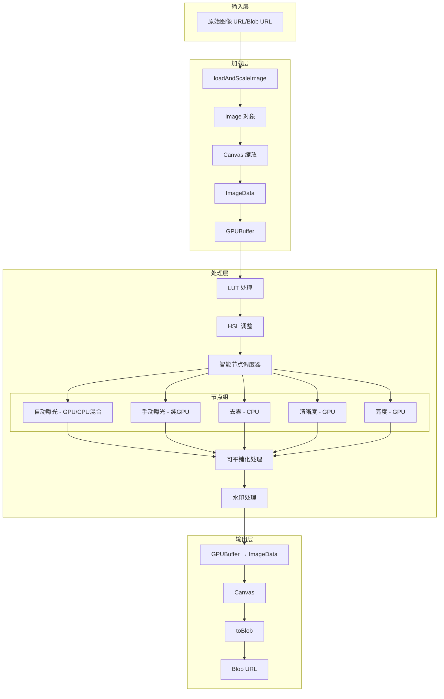
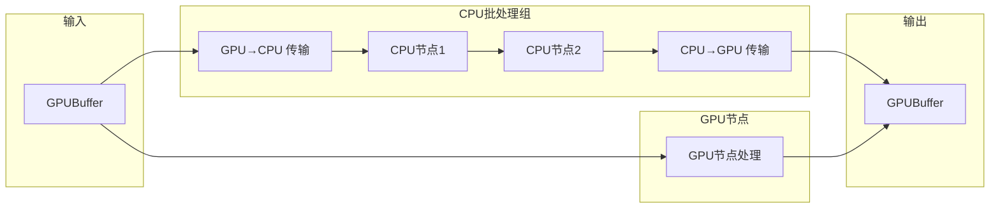
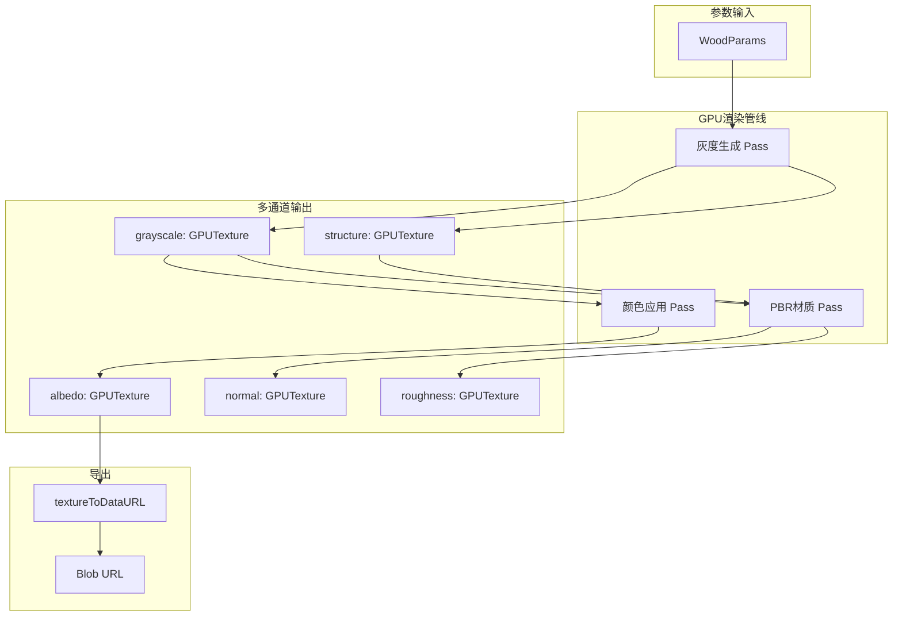
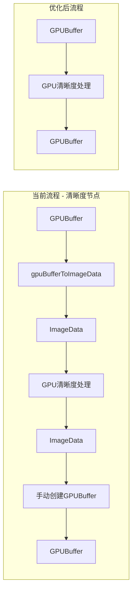
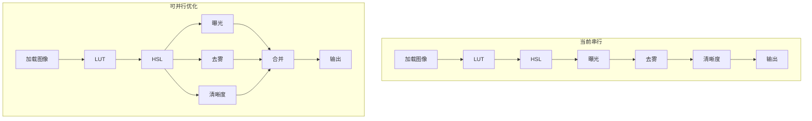
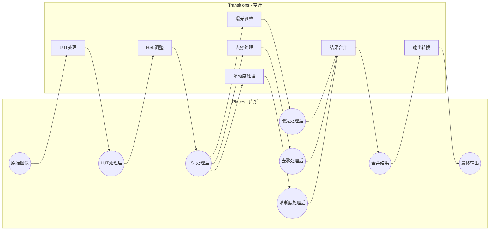
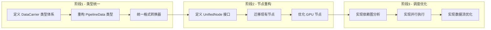

# 统一高性能流水线化接口架构分析报告

## 1. 现有接口模式总结

### 1.1 核心数据类型

项目中存在以下核心数据类型：

| 数据类型 | 定义位置 | 用途 |
|---------|---------|------|
| `PipelineData` | [`PipelineData.type.ts`](demo/src/types/PipelineData.type.ts:4) | 管线数据载体，包含 `buffer: GPUBuffer \| GPUTexture`、`width`、`height` |
| `PipelineDataMultiRecord` | [`PipelineData.type.ts`](demo/src/types/PipelineData.type.ts:12) | 多通道管线数据，`Record<string, PipelineData>` |
| `ImageData` | Web API | CPU 端图像数据 |
| `GPUBuffer` | WebGPU API | GPU 端缓冲区 |
| `GPUTexture` | WebGPU API | GPU 端纹理 |

### 1.2 现有接口模式分类

#### 模式 A：节点处理模式（Node Pattern）

定义于 [`types.ts`](demo/src/processPipelines/nodes/types.ts:21)：

```typescript
interface Node<TOptions extends baseOptions = baseOptions> {
  名称?: string
  可接受输入: 管线数据格式[]  // 'GPUBuffer' | 'ImageData'
  输出格式: 管线数据格式
  guard(options: TOptions): boolean
  process(context: NodeContext<TOptions>): Promise<void>
  cpuProcess?: (imageData: ImageData, options: TOptions) => Promise<ImageData>
}
```

**特点**：
- 声明式输入/输出格式
- 支持 CPU 批处理优化
- 通过 `guard` 函数控制执行条件
- 上下文传递模式（`NodeContext`）

#### 模式 B：管线步骤模式（Pipeline Step Pattern）

定义于 [`PipelineData.type.ts`](demo/src/types/PipelineData.type.ts:21)：

```typescript
interface GeneralSynthesisPipelineStep {
  execute(data: PipelineData, options: baseOptions): Promise<PipelineData>
}
```

**特点**：
- 函数式接口
- 输入输出类型一致
- 无状态处理

#### 模式 C：程序化生成器模式（Procedural Generator Pattern）

以 [`woodGeneratorPipeline.ts`](demo/src/proceduralTexturing/wood/woodGeneratorPipeline.ts:522) 为例：

```typescript
async function generateWoodTexturePipeline(
  params: WoodParams,
  width: number,
  height: number,
  options: { includePBR?: boolean }
): Promise<PipelineDataMultiRecord>
```

**特点**：
- 多通道输出（albedo、normal、roughness 等）
- 纯 GPU 处理
- 返回 `GPUTexture` 而非 `GPUBuffer`

### 1.3 格式转换函数

| 函数 | 位置 | 转换方向 |
|-----|------|---------|
| [`gpuBufferToImageData()`](demo/src/utils/webgpu/convert/gpuBufferToImageData.ts:4) | webgpu/convert | GPUBuffer/GPUTexture → ImageData |
| [`imageDataToGPUBuffer()`](demo/src/processPipelines/imageProcessor.utils.ts) | imageProcessor.utils | ImageData → GPUBuffer |
| [`gpuBufferToCanvas()`](demo/src/processPipelines/nodes/watermarkNode.utils.ts:24) | watermarkNode.utils | GPUBuffer → Canvas |
| [`canvasToGpuBuffer()`](demo/src/processPipelines/nodes/watermarkNode.utils.ts:53) | watermarkNode.utils | Canvas → GPUBuffer |
| [`gpuBufferToTexture()`](demo/src/processPipelines/nodes/autoExposureNode.ts:26) | autoExposureNode | GPUBuffer → GPUTexture |
| [`textureToDataURL()`](demo/src/proceduralTexturing/wood/woodGeneratorPipeline.ts:174) | woodGeneratorPipeline | GPUTexture → Blob URL |

## 2. 数据流图

### 2.1 图像处理管线数据流



### 2.2 节点调度器数据流



### 2.3 程序化生成器数据流



## 3. 问题点和改进建议

### 3.1 接口不一致问题

| 问题 | 位置 | 影响 | 建议 |
|-----|------|------|------|
| **PipelineData.buffer 类型混乱** | [`PipelineData.type.ts:5`](demo/src/types/PipelineData.type.ts:5) | `buffer: GPUBuffer \| GPUTexture` 联合类型导致运行时需要类型检查 | 分离为 `BufferPipelineData` 和 `TexturePipelineData` |
| **格式转换函数分散** | 多个文件 | 相同功能的转换函数在不同位置重复实现 | 统一到 `formatConverter.ts` |
| **节点输出格式声明与实际不符** | 如 [`dehazeNode.ts:19`](demo/src/processPipelines/nodes/dehazeNode.ts:19) | 声明 `输出格式: 'ImageData'` 但实际输出 GPUBuffer | 修正声明或统一输出格式 |
| **程序化生成器返回类型不一致** | [`woodGeneratorPipeline.ts`](demo/src/proceduralTexturing/wood/woodGeneratorPipeline.ts) | 返回 GPUTexture 但类型声明为 PipelineData | 扩展 PipelineData 或创建新类型 |

### 3.2 数据类型流转问题

#### 3.2.1 不必要的类型转换



**问题节点**：
- [`clarityNode.ts`](demo/src/processPipelines/nodes/clarityNode.ts:33)：GPU 处理却需要 ImageData 中转
- [`luminanceNode.ts`](demo/src/processPipelines/nodes/luminanceNode.ts:36)：同上
- [`autoExposureNode.ts`](demo/src/processPipelines/nodes/autoExposureNode.ts:130)：CDF 模式需要 CPU 直方图计算

#### 3.2.2 可保持原生类型的场景

| 场景 | 当前实现 | 可优化为 |
|-----|---------|---------|
| 纯 GPU 处理链 | GPUBuffer → ImageData → GPU处理 → ImageData → GPUBuffer | GPUBuffer → GPU处理 → GPUBuffer |
| 纹理采样处理 | GPUTexture → GPUBuffer → 处理 | GPUTexture → 直接采样处理 |
| 最终输出 | GPUBuffer → ImageData → Canvas → Blob | GPUBuffer → 直接渲染到 Canvas |

### 3.3 异步状态管理问题

#### 3.3.1 当前异步模式

```typescript
// 串行执行模式 - scheduler.ts
for (const 节点 of 节点列表) {
    await 节点.process(context)  // 阻塞等待
}
```

**问题**：
1. **无法并行执行独立节点**：如去雾和清晰度可以并行
2. **无法流水线化**：前一帧输出时，后一帧无法开始处理
3. **资源竞争无管理**：多个节点可能同时请求 GPUDevice

#### 3.3.2 复杂异步依赖示例



## 4. 统一接口架构设计草案

### 4.1 核心类型重构

#### 4.1.1 数据载体类型

```typescript
// 基础数据载体接口
interface DataCarrier {
  readonly width: number
  readonly height: number
  readonly format: DataFormat
  destroy(): void
}

// 数据格式枚举
type DataFormat =
  | 'GPUBuffer'      // GPU 缓冲区
  | 'GPUTexture'     // GPU 纹理
  | 'ImageData'      // CPU ImageData
  | 'Canvas'         // Canvas 元素
  | 'Blob'           // Blob 对象
  | 'BlobURL'        // Blob URL 字符串

// GPUBuffer 载体
interface GPUBufferCarrier extends DataCarrier {
  format: 'GPUBuffer'
  buffer: GPUBuffer
}

// GPUTexture 载体
interface GPUTextureCarrier extends DataCarrier {
  format: 'GPUTexture'
  texture: GPUTexture
  textureFormat: GPUTextureFormat
}

// 联合类型
type PipelineCarrier = GPUBufferCarrier | GPUTextureCarrier
```

#### 4.1.2 统一转换器接口

```typescript
// 转换器注册表
interface ConverterRegistry {
  register<TFrom extends DataFormat, TTo extends DataFormat>(
    from: TFrom,
    to: TTo,
    converter: Converter<TFrom, TTo>
  ): void
  
  convert<TFrom extends DataFormat, TTo extends DataFormat>(
    data: CarrierOf<TFrom>,
    to: TTo,
    context: ConversionContext
  ): Promise<CarrierOf<TTo>>
}

// 转换上下文
interface ConversionContext {
  device: GPUDevice
  cache?: WeakMap<object, object>
}
```

### 4.2 统一节点接口

```typescript
// 节点能力声明
interface NodeCapability {
  // 支持的输入格式（按优先级排序）
  acceptedInputs: DataFormat[]
  // 输出格式
  outputFormat: DataFormat
  // 是否支持原地处理（不创建新缓冲区）
  supportsInPlace?: boolean
  // 是否可并行执行
  parallelizable?: boolean
  // 依赖的其他节点
  dependencies?: string[]
}

// 统一节点接口
interface UnifiedNode<TOptions = unknown> {
  readonly name: string
  readonly capability: NodeCapability
  
  // 条件检查
  shouldExecute(options: TOptions): boolean
  
  // 处理函数 - 返回新的载体
  process(
    input: PipelineCarrier,
    options: TOptions,
    context: ProcessContext
  ): Promise<PipelineCarrier>
}

// 处理上下文
interface ProcessContext {
  device: GPUDevice
  converterRegistry: ConverterRegistry
  cache: WeakMap<object, object>
  signal?: AbortSignal  // 支持取消
}
```

### 4.3 智能管线调度器

```typescript
// 调度策略
type ScheduleStrategy = 'serial' | 'parallel' | 'adaptive'

// 管线调度器
interface PipelineScheduler {
  // 添加节点
  addNode(node: UnifiedNode, priority?: number): void
  
  // 执行管线
  execute(
    input: PipelineCarrier,
    options: Record<string, unknown>,
    strategy?: ScheduleStrategy
  ): Promise<PipelineCarrier>
  
  // 获取执行计划
  getExecutionPlan(options: Record<string, unknown>): ExecutionPlan
}

// 执行计划
interface ExecutionPlan {
  stages: ExecutionStage[]
  estimatedTransfers: number  // 预估的 GPU↔CPU 传输次数
}

interface ExecutionStage {
  nodes: UnifiedNode[]
  canParallel: boolean
  inputFormat: DataFormat
  outputFormat: DataFormat
}
```

### 4.4 数据流优化器


```typescript
// 数据流优化器
interface DataFlowOptimizer {
  // 分析节点依赖图
  analyzeDependencies(nodes: UnifiedNode[]): DependencyGraph
  
  // 合并连续同类型节点
  mergeContinuousNodes(plan: ExecutionPlan): ExecutionPlan
  
  // 最小化格式转换
  minimizeConversions(plan: ExecutionPlan): ExecutionPlan
}
```

## 5. Petri 网适用性评估

### 5.1 项目中的并发场景分析

| 场景 | 并发特征 | 复杂度 | Petri 网适用性 |
|-----|---------|--------|---------------|
| **图像处理管线** | 串行为主，部分可并行 | 中等 | ⭐⭐ 一般适用 |
| **程序化生成器** | 多 Pass 串行，多通道并行输出 | 中等 | ⭐⭐ 一般适用 |
| **批量导出** | 多图并行处理 | 简单 | ⭐ 过度设计 |
| **实时预览** | 参数变化触发重新处理 | 简单 | ⭐ 过度设计 |
| **多图层合成** | 图层间依赖，部分可并行 | 较高 | ⭐⭐⭐ 适用 |

### 5.2 Petri 网建模示例

#### 5.2.1 图像处理管线的 Petri 网模型



### 5.3 Petri 网引入的收益与成本

#### 收益

1. **形式化并发建模**：精确描述节点间的依赖和并发关系
2. **死锁检测**：可通过可达性分析检测潜在死锁
3. **资源管理**：通过有色 Petri 网管理 GPU 资源竞争
4. **可视化调试**：直观展示数据流状态

#### 成本

1. **学习曲线**：团队需要学习 Petri 网理论
2. **实现复杂度**：需要实现 Petri 网执行引擎
3. **运行时开销**：Token 传递和状态管理的额外开销
4. **过度设计风险**：对于简单场景可能过于复杂

### 5.4 评估结论

**建议：暂不引入完整的 Petri 网框架**

**理由**：
1. 当前项目的并发场景相对简单，主要是串行处理
2. 现有的智能调度器已能处理 CPU 批处理优化
3. 引入 Petri 网的成本较高，收益有限

**替代方案**：
1. **轻量级依赖图**：使用简单的 DAG 描述节点依赖
2. **Promise.all 并行**：对独立节点使用原生并行
3. **响应式流**：考虑使用 RxJS 处理复杂异步场景

```typescript
// 轻量级依赖图示例
interface DependencyGraph {
  nodes: Map<string, UnifiedNode>
  edges: Map<string, string[]>  // nodeId -> dependencyIds
  
  // 拓扑排序获取执行顺序
  getExecutionOrder(): string[][]  // 返回可并行执行的节点组
}
```

## 6. 实施路线图

### 6.1 阶段划分



### 6.2 具体任务清单

#### 阶段 1：类型统一

- [ ] 创建 `types/carrier.types.ts`，定义 `DataCarrier` 类型体系
- [ ] 创建 `types/format.types.ts`，定义 `DataFormat` 枚举
- [ ] 重构 `PipelineData.type.ts`，使用新类型体系
- [ ] 创建 `converters/registry.ts`，实现转换器注册表
- [ ] 迁移现有转换函数到统一位置

#### 阶段 2：节点重构

- [ ] 创建 `nodes/unified.types.ts`，定义 `UnifiedNode` 接口
- [ ] 创建节点适配器，兼容旧节点接口
- [ ] 逐个迁移现有节点到新接口
- [ ] 优化 GPU 节点，减少不必要的格式转换

#### 阶段 3：调度优化

- [ ] 创建 `scheduler/dependency-graph.ts`，实现依赖图
- [ ] 创建 `scheduler/parallel-executor.ts`，实现并行执行
- [ ] 创建 `scheduler/optimizer.ts`，实现数据流优化
- [ ] 集成到现有管线

## 7. 总结

### 7.1 关键发现

1. **接口模式多样**：项目中存在三种主要接口模式（Node、PipelineStep、Generator），需要统一
2. **类型转换频繁**：GPU↔CPU 转换是主要性能瓶颈，需要优化
3. **调度器已有基础**：现有智能调度器已实现 CPU 批处理，可在此基础上扩展
4. **Petri 网过度设计**：当前场景不需要完整的 Petri 网框架

### 7.2 核心建议

| 优先级 | 建议 | 预期收益 |
|-------|------|---------|
| 高 | 统一数据载体类型 | 减少类型检查，提高代码可维护性 |
| 高 | 集中格式转换器 | 避免重复实现，便于优化 |
| 中 | 优化 GPU 节点 | 减少 GPU↔CPU 传输，提升性能 |
| 中 | 实现依赖图调度 | 支持并行执行，提升吞吐量 |
| 低 | 引入轻量级状态管理 | 支持复杂异步场景 |

### 7.3 风险提示

1. **向后兼容**：重构需要保持与现有代码的兼容性
2. **测试覆盖**：需要充分的测试确保重构不引入 bug
3. **渐进式迁移**：建议分阶段实施，避免大规模重写

