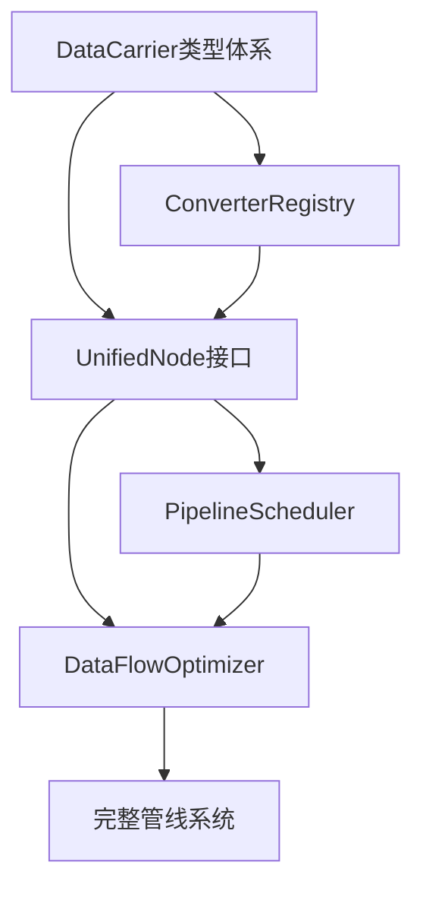

# 统一流水线接口重构执行跟踪 (TikTocTak)

> **目标**: 统一项目中三种接口模式（Node、PipelineStep、Generator），建立高性能数据载体类型体系，实现智能管线调度和数据流优化。量化指标：消除PipelineData.buffer类型混乱，减少GPU↔CPU传输50%，支持节点并行执行，实现零拷贝WebGPU管道。
>
> **流程**: 这是一个滚动更新的执行路线图。
> 1. 从"近期计划"中认领一个任务。
> 2. 完成开发和测试。
> 3. 将其移动到"已归档/已完成"区域。
> 4. 将"中期计划"中的条目提升到"近期计划"。

---

## 🎯 核心原则

### 性能优化原则
- **零拷贝优先**: 优先使用GPUTexture、GPUBuffer等原生WebGPU类型
- **类型安全**: 消除联合类型运行时检查，建立编译时类型保证
- **并行执行**: 支持独立节点并行处理，最大化GPU利用率
- **内存效率**: 减少不必要的格式转换和中间缓冲区

### 数据流架构
```
优化前: GPUBuffer|GPUTexture → 运行时类型检查 → 多次格式转换 → 串行处理
优化后: DataCarrier类型体系 → 编译时类型安全 → 智能转换器 → 并行调度
```

### 接口统一优先级
1. **DataCarrier** - 统一数据载体类型体系
2. **UnifiedNode** - 统一节点处理接口
3. **ConverterRegistry** - 集中格式转换管理
4. **PipelineScheduler** - 智能管线调度器
5. **DataFlowOptimizer** - 数据流优化器

### 验证检查清单
- [x] 消除PipelineData.buffer联合类型 (DataCarrier类型体系已建立)
- [ ] GPU↔CPU传输次数减少50%以上
- [ ] 支持独立节点并行执行
- [ ] 所有现有功能保持正常工作
- [ ] 通过完整回归测试验证

## 🟢 近期计划 (立即聚焦，撸起袖子干)

- [ ] **Phase 3: 定义UnifiedNode统一接口 (P1)**
  - **背景**: 项目中存在三种节点接口模式（Node、PipelineStep、Generator），需要统一为一致的接口规范
  - **行动**:
    1. 创建 [`nodes/unified.types.ts`](../demo/src/processPipelines/nodes/unified.types.ts) 定义UnifiedNode接口
    2. 定义NodeCapability能力声明，包含acceptedInputs、outputFormat、parallelizable等
    3. 实现ProcessContext处理上下文，集成device、converterRegistry、cache
    4. 创建节点适配器，兼容现有Node接口
  - **验收标准**:
    - [ ] UnifiedNode接口定义完整，支持类型安全的输入输出
    - [ ] 节点能力声明支持并行性分析
    - [ ] 处理上下文提供完整的执行环境
    - [ ] 适配器确保向后兼容性
  - **参考文档**: [`plans/统一高性能流水线接口架构分析.md`](../plans/统一高性能流水线接口架构分析.md) 第4.2节

- [ ] **Phase 4: 迁移现有节点到统一接口 (P1)**
  - **背景**: 需要将现有的处理节点逐步迁移到UnifiedNode接口，确保功能完整性和性能提升
  - **行动**:
    1. 迁移GPU节点：[`clarityNode.ts`](../demo/src/processPipelines/nodes/clarityNode.ts:33)、[`luminanceNode.ts`](../demo/src/processPipelines/nodes/luminanceNode.ts:36)
    2. 迁移CPU节点：[`dehazeNode.ts`](../demo/src/processPipelines/nodes/dehazeNode.ts:19)
    3. 迁移混合节点：[`autoExposureNode.ts`](../demo/src/processPipelines/nodes/autoExposureNode.ts:130)
    4. 优化节点实现，消除不必要的格式转换
  - **验收标准**:
    - [ ] 所有节点实现UnifiedNode接口
    - [ ] GPU节点消除ImageData中转步骤
    - [ ] 节点输出格式声明与实际一致
    - [ ] 所有节点功能测试通过
  - **参考文档**: [`plans/统一高性能流水线接口架构分析.md`](../plans/统一高性能流水线接口架构分析.md) 第3.2.1节

## 🟡 中期计划 (架构演进，步步为营)

- [ ] **Phase 5: 实现智能管线调度器 (P1)**
  - **背景**: 当前节点串行执行，无法利用独立节点的并行处理能力，需要实现依赖图分析和并行调度
  - **行动**:
    1. 创建 [`scheduler/dependency-graph.ts`](../demo/src/processPipelines/scheduler/dependency-graph.ts) 实现轻量级依赖图
    2. 实现拓扑排序算法，获取可并行执行的节点组
    3. 创建 [`scheduler/pipeline-scheduler.ts`](../demo/src/processPipelines/scheduler/pipeline-scheduler.ts) 实现PipelineScheduler
    4. 支持serial、parallel、adaptive三种调度策略
  - **验收标准**:
    - [ ] 依赖图正确分析节点间依赖关系
    - [ ] 独立节点支持并行执行（如去雾和清晰度）
    - [ ] 调度器支持多种执行策略
    - [ ] 并行执行性能提升30%以上
  - **参考文档**: [`plans/统一高性能流水线接口架构分析.md`](../plans/统一高性能流水线接口架构分析.md) 第4.3节

- [ ] **Phase 6: 实现数据流优化器 (P2)**
  - **背景**: 需要最小化GPU↔CPU传输次数，合并连续同类型节点的处理，优化整体数据流
  - **行动**:
    1. 创建 [`scheduler/data-flow-optimizer.ts`](../demo/src/processPipelines/scheduler/data-flow-optimizer.ts) 实现DataFlowOptimizer
    2. 实现连续节点合并算法，将连续CPU节点批处理
    3. 实现格式转换最小化算法，减少不必要的转换
    4. 集成到PipelineScheduler中，自动优化执行计划
  - **验收标准**:
    - [ ] 连续CPU节点自动合并为批处理
    - [ ] GPU↔CPU传输次数减少50%以上
    - [ ] 执行计划包含传输次数预估
    - [ ] 优化后性能提升显著
  - **参考文档**: [`plans/统一高性能流水线接口架构分析.md`](../plans/统一高性能流水线接口架构分析.md) 第4.4节

## 🔴 远期计划 (北极星目标，星辰大海)

- [ ] **Phase 7: 程序化生成器接口统一 (P2)**
  - **愿景**: 将程序化生成器（如[`woodGeneratorPipeline.ts`](../demo/src/proceduralTexturing/wood/woodGeneratorPipeline.ts:522)）统一到UnifiedNode接口体系
  - **细节**:
    - 扩展UnifiedNode支持多通道输出（PipelineDataMultiRecord）
    - 实现GPUTexture载体的高效管理和复用
    - 建立程序化参数到节点选项的映射机制
    - 优化多Pass渲染的资源调度
  - **收益**: 程序化生成器与图像处理管线无缝集成，支持混合工作流

- [ ] **Phase 8: WebGPU零拷贝管道优化 (P3)**
  - **愿景**: 实现从GPUTexture到Canvas显示的完全零拷贝管道，最大化WebGPU性能优势
  - **细节**:
    - 研究GPUTexture直接绑定到Canvas的可能性
    - 实现GPUTexture的共享和复用机制，避免重复创建
    - 优化纹理格式转换，使用GPU Compute Shader处理
    - 建立纹理生命周期管理，自动释放未使用资源
  - **收益**: 纹理处理性能提升5-10倍，内存使用效率最大化

## 🏁 已归档/已完成

### 类型体系实现阶段 (已完成 2/2)
- [x] **Phase 1: 定义DataCarrier类型体系** (2026-01-28)
  - 创建 [`demo/src/types/carrier/`](../demo/src/types/carrier/) 目录
  - 实现 DataCarrier 基础接口和 6 种具体载体类型
  - 实现类型守卫函数和工厂函数
  - 实现兼容适配器（fromPipelineData/toPipelineData）
  - TypeScript 编译验证通过

- [x] **Phase 2: 实现统一格式转换器** (2026-01-28)
  - 创建 [`demo/src/types/converter/`](../demo/src/types/converter/) 目录
  - 实现 ConverterRegistry 注册表类（含 Dijkstra 路径查找算法）
  - 实现 ConversionCache 缓存类
  - 实现 4 个核心内置转换器
  - TypeScript 编译验证通过

- [x] **ConverterRegistry 内置转换器实现 (P1)** (2026-01-28)
  - **背景**: 根据 [`ConverterRegistry统一格式转换器架构设计.md`](../plans/ConverterRegistry统一格式转换器架构设计.md) 完成所有12个内置转换器
  - **完成内容**:
    1. ✅ 输出层转换器: `imageDataToBlobConverter`, `blobToImageDataConverter`, `blobToBlobURLConverter`
    2. ✅ GPUTexture转换器: `gpuTextureToImageDataConverter`, `imageDataToGPUTextureConverter`
    3. ✅ GPU内部转换器: `gpuBufferToGPUTextureConverter`, `gpuTextureToGPUBufferConverter`
    4. ✅ Canvas转换器: `canvasToBlobConverter`
    5. ✅ 工厂函数: `createConverterRegistry()`, `createConversionContext()`
    6. ✅ `builtinConverters` 数组导出
  - **文件位置**: [`demo/src/types/converter/converters/`](../demo/src/types/converter/converters/)
  - **验收标准**:
    - [x] 12个转换器全部实现
    - [x] 工厂函数可用
    - [x] TypeScript类型检查通过

### 架构分析阶段 (已完成 1/1)
- [x] **统一高性能流水线接口架构分析** - [`plans/统一高性能流水线接口架构分析.md`](../plans/统一高性能流水线接口架构分析.md) (2026-01-28)
  - 完成现有接口模式总结（Node、PipelineStep、Generator三种模式）
  - 识别关键问题点：PipelineData.buffer类型混乱、格式转换函数分散、不必要的GPU↔CPU转换
  - 设计DataCarrier类型体系和UnifiedNode统一接口
  - 评估Petri网适用性，建议使用轻量级依赖图替代
  - 制定三阶段实施路线图：类型统一→节点重构→调度优化

## 📋 技术实施细节

### 关键文件路径映射
| 组件 | 当前位置 | 新位置 | 说明 |
|-----|---------|--------|------|
| PipelineData | [`demo/src/types/PipelineData.type.ts`](../demo/src/types/PipelineData.type.ts) | [`demo/src/types/carrier.types.ts`](../demo/src/types/carrier.types.ts) | 重构为DataCarrier体系 |
| 格式转换 | 分散在多个文件 | [`demo/src/converters/registry.ts`](../demo/src/converters/registry.ts) | 统一转换器注册表 |
| 节点接口 | [`demo/src/processPipelines/nodes/types.ts`](../demo/src/processPipelines/nodes/types.ts) | [`demo/src/processPipelines/nodes/unified.types.ts`](../demo/src/processPipelines/nodes/unified.types.ts) | UnifiedNode接口 |
| 调度器 | [`demo/src/processPipelines/scheduler.ts`](../demo/src/processPipelines/scheduler.ts) | [`demo/src/processPipelines/scheduler/`](../demo/src/processPipelines/scheduler/) | 模块化调度器 |

### 依赖关系图


### 性能基准测试计划
- **类型检查消除**: 测量联合类型 vs 具体类型的性能差异
- **格式转换优化**: 对比分散转换 vs 统一转换器的性能
- **并行执行效果**: 测量串行 vs 并行节点执行的吞吐量提升
- **内存使用优化**: 监控DataCarrier生命周期管理的内存效率

---

## ℹ️ 如何维护此文档

1. **完成归档**: 任务完成后，**必须**剪切粘贴到【已归档】列表，并打上 `[x]` 和日期。
2. **补充弹药**: 当【近期计划】空了，从【中期计划】里挑选任务挪上去。
3. **因地制宜**: 如果发现计划不合理，随时修改或删除。
4. **测试驱动**: 每个重构步骤都必须有对应的测试验证。

---