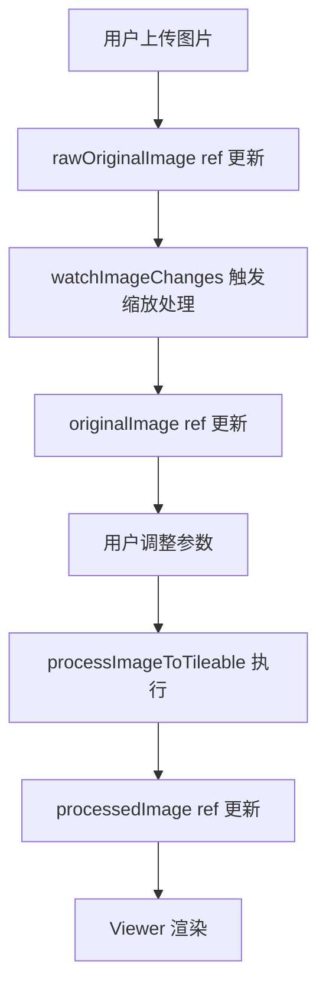
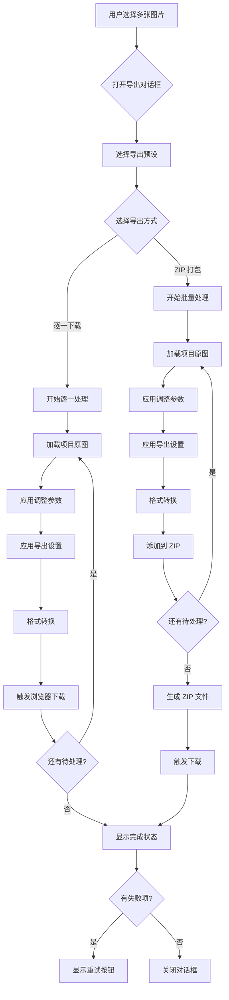

# 多图片批量修改与管理实现计划 (详细版)

## 1. 核心目标

支持在**桌面端与移动端**同时导入和管理多张图片，提供批量调整参数、复制粘贴参数、批量导出等功能。所有数据（元数据与图像文件）必须且仅能通过项目现有的 `src/infra/IndexDBFS.class.ts` 进行持久化存储。

---

## 2. 项目现状分析

### 2.1 当前架构概览

```
demo/src/
├── infra/
│   └── IndexDBFS.class.ts       # ✅ 已有 IndexedDB 文件系统封装
├── composables/
│   ├── useTextureState.ts       # 单图片状态管理 (originalImage, processedImage)
│   ├── useTextureGenerator.ts   # 组合逻辑层，整合 state + params
│   ├── useAdjustmentParams.ts   # 调整参数管理 (HSL, 曝光, 去雾, 清晰度, 亮度)
│   ├── useImageHandling.ts      # 图像上传/保存逻辑
│   └── useGlobalDragDrop.ts     # 拖放上传 (目前仅支持单文件)
├── Desktop.vue                   # 桌面端入口 (左侧控制栏 + 右侧查看器)
└── App.vue                       # 移动端入口 (底部控制面板 + 顶部查看器)
```

### 2.2 当前单图模式的工作流程



**关键问题**：
- `useTextureState` 只维护 **单张图片** 的 `originalImage` / `processedImage`
- 调整参数 (`useAdjustmentParams`) 是全局单例，无法按图片存储
- 无持久化机制，刷新后丢失所有数据

### 2.3 现有 IndexDBFS API

| 方法 | 说明 |
|------|------|
| `write(path, data)` | 写入文件，path 格式 `storeName/key` |
| `read(path)` | 读取文件 |
| `delete(path)` | 删除文件 |
| `list(dir)` | 列出目录下所有 keys |
| `readdir(dir)` | 获取目录下所有文件内容 |
| `clear(dir)` | 清空目录 |
| `transaction(...)` | 原子性批处理 |

---

## 3. 设计方案与选型依据

### 3.1 为何不用 Pinia/Vuex？

| 方案 | 优点 | 缺点 | 结论 |
|------|------|------|------|
| **Pinia** | 标准化、DevTools 支持 | 引入新依赖，需重构现有 composables | ❌ |
| **Composables 单例** | 无依赖、与现有架构一致 | 需手动管理响应式 | ✅ 选用 |

**选型理由**：项目已有成熟的 Composable 模式 (`useTextureGenerator` 等)，引入新状态管理库会破坏一致性。通过单例 Composable + Symbol Key 可实现等效的全局状态共享。

### 3.2 存储方案：统一文件系统适配器接口

本项目**不是只选择 IndexedDB**，而是设计一个**统一的文件系统适配器接口**，IndexedDB 只是默认实现之一。这种设计允许未来扩展到其他存储后端。

| 适配器实现 | 优点 | 缺点 | 状态 |
|-----------|------|------|------|
| **IndexedDB (IndexDBFS)** | 已封装好、无授权、离线可用 | 容量受限 (~1GB) | ✅ 默认实现 |
| **File System Access API** | 真实文件系统、大容量 | 浏览器支持差、需用户授权 | 🔮 Future |
| **云存储 (S3/OSS)** | 跨设备同步、无限容量 | 需网络、需后端 | 🔮 Future |
| **Electron fs** | 桌面端原生支持 | 仅限桌面端 | 🔮 Future |

**设计原则**：
- 所有存储操作通过统一的 `IFileSystemAdapter` 接口进行
- 业务层代码完全不感知底层存储实现
- 可在运行时切换适配器（如用户授权 File System Access 后自动切换）

```typescript
/**
 * 统一文件系统适配器接口
 * 所有存储后端必须实现此接口
 */
interface IFileSystemAdapter {
    /** 读取文件 */
    read<T>(path: string): Promise<T | null>
    /** 写入文件 */
    write<T>(path: string, data: T): Promise<void>
    /** 删除文件 */
    delete(path: string): Promise<void>
    /** 列出目录下所有文件名 */
    list(dir: string): Promise<string[]>
    /** 读取目录下所有文件内容 */
    readdir<T>(dir: string): Promise<T[]>
    /** 清空目录 */
    clear(dir: string): Promise<void>
    /** 检查适配器是否可用 */
    isAvailable(): Promise<boolean>
    /** 适配器名称 (用于调试/日志) */
    readonly name: string
}
```

### 3.3 图像存储策略

无论使用哪种适配器实现，图像存储策略保持一致：

| 存储内容 | 格式 | 预估大小/图 | 必要性 |
|----------|------|-------------|--------|
| 原图 | Blob (原格式) | 1~10 MB | ✅ 必须 (用于重新处理) |
| 处理结果 | ❌ 不存储 | - | ⚠️ 可重新生成 |
| 缩略图 | WebP Blob | ~50 KB | ✅ 必须 (快速预览) |
| 参数快照 | JSON | ~1 KB | ✅ 必须 (恢复状态) |

**结论**：存储原图 + 缩略图 + 参数，处理结果按需重新计算。

---

## 4. 详细架构设计

### 4.1 数据模型

```typescript
/**
 * 图片项目元数据
 * 路径: projects/{id}.json
 */
interface ImageProject {
    /** 唯一标识符 (UUID) */
    id: string
    /** 文件名 (用于导出时的命名) */
    name: string
    /** 创建时间戳 */
    createdAt: number
    /** 最后修改时间戳 */
    updatedAt: number
    /** 原图在 assets store 中的路径 */
    originalPath: string  // 格式: assets/{id}_original
    /** 缩略图在 assets store 中的路径 */
    thumbnailPath: string // 格式: assets/{id}_thumb
    /** 调整参数快照 */
    params: ProjectParams
}

/**
 * 调整参数快照
 * 与 useAdjustmentParams 返回值对应
 */
interface ProjectParams {
    globalHSL: { hue: number; saturation: number; lightness: number }
    hslLayers: HSLAdjustmentLayer[]
    exposureStrength: number
    exposureManual: { exposure: number; contrast: number; gamma: number }
    dehazeParams: DehazeParams
    clarityParams: ClarityParams
    luminanceParams: LuminanceAdjustmentParams
    borderSize: number
    maxResolution: number
}
```

### 4.2 存储层设计 (适配器模式)

#### 4.2.1 IndexedDB 适配器实现

**新建文件**: `demo/src/infra/adapters/IndexDBFSAdapter.ts`

```typescript
import { IndexDBFS } from '../IndexDBFS.class'
import type { IFileSystemAdapter } from './IFileSystemAdapter'

/**
 * IndexedDB 文件系统适配器
 * 基于现有的 IndexDBFS 封装实现
 */
export class IndexDBFSAdapter implements IFileSystemAdapter {
    readonly name = 'IndexedDB'
    private fs: IndexDBFS

    constructor(dbName: string, stores: string[], version: number = 1) {
        this.fs = new IndexDBFS(dbName, stores, version)
    }

    async read<T>(path: string): Promise<T | null> {
        return await this.fs.read<T>(path)
    }

    async write<T>(path: string, data: T): Promise<void> {
        await this.fs.write(path, data)
    }

    async delete(path: string): Promise<void> {
        await this.fs.delete(path)
    }

    async list(dir: string): Promise<string[]> {
        const keys = await this.fs.list(dir)
        return keys.map(k => String(k))
    }

    async readdir<T>(dir: string): Promise<T[]> {
        return await this.fs.readdir<T>(dir)
    }

    async clear(dir: string): Promise<void> {
        await this.fs.clear(dir)
    }

    async isAvailable(): Promise<boolean> {
        return typeof indexedDB !== 'undefined'
    }
}
```

#### 4.2.2 项目文件系统服务

**新建文件**: `demo/src/infra/ProjectFileSystem.ts`

```typescript
import type { IFileSystemAdapter } from './adapters/IFileSystemAdapter'
import { IndexDBFSAdapter } from './adapters/IndexDBFSAdapter'

const DB_NAME = 'TextureGeneratorProjectsDB'
const STORES = ['projects', 'assets'] as const

/**
 * 项目文件系统服务
 * 通过适配器接口与底层存储解耦
 */
class ProjectFileSystem {
    private adapter: IFileSystemAdapter

    constructor(adapter?: IFileSystemAdapter) {
        // 默认使用 IndexedDB 适配器
        this.adapter = adapter ?? new IndexDBFSAdapter(DB_NAME, [...STORES], 1)
    }

    /** 切换到新的适配器 (如用户授权 File System Access 后) */
    setAdapter(adapter: IFileSystemAdapter): void {
        this.adapter = adapter
    }

    /** 获取当前适配器名称 */
    getAdapterName(): string {
        return this.adapter.name
    }

    // === 项目元数据操作 ===

    /** 保存项目元数据 */
    async saveProject(project: ImageProject): Promise<void> {
        await this.adapter.write(`projects/${project.id}`, project)
    }

    /** 加载所有项目元数据 */
    async loadAllProjects(): Promise<ImageProject[]> {
        return await this.adapter.readdir<ImageProject>('projects')
    }

    /** 删除项目 (含资产) */
    async deleteProject(project: ImageProject): Promise<void> {
        await this.adapter.delete(`projects/${project.id}`)
        await this.adapter.delete(project.originalPath)
        await this.adapter.delete(project.thumbnailPath)
    }

    // === 资产操作 ===

    /** 保存资产 (原图/缩略图) */
    async saveAsset(key: string, blob: Blob): Promise<void> {
        await this.adapter.write(`assets/${key}`, blob)
    }

    /** 加载资产 */
    async loadAsset(key: string): Promise<Blob | null> {
        return await this.adapter.read<Blob>(`assets/${key}`)
    }
}

// 单例导出 (默认使用 IndexedDB 适配器)
export const projectFS = new ProjectFileSystem()
```

#### 4.2.3 Future: File System Access API 适配器 (示例)

```typescript
/**
 * File System Access API 适配器
 * 需要用户授权，但可以访问真实文件系统
 * 
 * 🔮 Future 实现
 */
export class FileSystemAccessAdapter implements IFileSystemAdapter {
    readonly name = 'FileSystemAccess'
    private rootHandle: FileSystemDirectoryHandle | null = null

    async requestAccess(): Promise<boolean> {
        try {
            this.rootHandle = await window.showDirectoryPicker({
                mode: 'readwrite'
            })
            return true
        } catch {
            return false
        }
    }

    async isAvailable(): Promise<boolean> {
        return 'showDirectoryPicker' in window && this.rootHandle !== null
    }

    // ... 其他方法实现
}
```

#### 4.2.4 适配器选择策略

```typescript
/**
 * 根据环境自动选择最佳适配器
 */
async function createBestAdapter(): Promise<IFileSystemAdapter> {
    // 1. 如果在 Electron 环境，使用 Node fs
    if (typeof process !== 'undefined' && process.versions?.electron) {
        return new ElectronFSAdapter()
    }

    // 2. 如果用户已授权 File System Access，使用它
    const fsAdapter = new FileSystemAccessAdapter()
    if (await fsAdapter.isAvailable()) {
        return fsAdapter
    }

    // 3. 默认使用 IndexedDB
    return new IndexDBFSAdapter(DB_NAME, [...STORES], 1)
}
```

### 4.3 状态管理层设计

**新建文件**: `demo/src/composables/useProjectState.ts`

```typescript
import { ref, computed, shallowRef } from 'vue'
import { projectFS } from '../infra/ProjectFileSystem'
import type { ImageProject, ProjectParams } from '../types/project.types'

// 单例模式 - 使用模块作用域变量
const projects = ref<ImageProject[]>([])
const activeProjectId = ref<string | null>(null)
const isLoading = ref(false)

// 当前加载的原图 (避免在 projects 数组中存储大数据)
const activeOriginalBlob = shallowRef<Blob | null>(null)

export function useProjectState() {
    // === 计算属性 ===

    const activeProject = computed(() => 
        projects.value.find(p => p.id === activeProjectId.value) ?? null
    )

    const projectCount = computed(() => projects.value.length)

    // === 初始化 ===

    async function loadProjects(): Promise<void> {
        isLoading.value = true
        try {
            projects.value = await projectFS.loadAllProjects()
            // 按更新时间倒序排列
            projects.value.sort((a, b) => b.updatedAt - a.updatedAt)
        } finally {
            isLoading.value = false
        }
    }

    // === 项目操作 ===

    async function createProject(file: File): Promise<ImageProject> {
        const id = crypto.randomUUID()
        const originalKey = `${id}_original`
        const thumbKey = `${id}_thumb`

        // 1. 保存原图
        await projectFS.saveAsset(originalKey, file)

        // 2. 生成并保存缩略图
        const thumbnail = await generateThumbnail(file, 200)
        await projectFS.saveAsset(thumbKey, thumbnail)

        // 3. 创建项目元数据
        const project: ImageProject = {
            id,
            name: file.name.replace(/\.[^.]+$/, ''),
            createdAt: Date.now(),
            updatedAt: Date.now(),
            originalPath: `assets/${originalKey}`,
            thumbnailPath: `assets/${thumbKey}`,
            params: getDefaultParams()
        }
        await projectFS.saveProject(project)

        // 4. 更新内存状态
        projects.value.unshift(project)
        return project
    }

    async function switchProject(id: string): Promise<void> {
        // 释放旧图内存
        if (activeOriginalBlob.value) {
            activeOriginalBlob.value = null
        }

        activeProjectId.value = id
        const project = activeProject.value
        if (!project) return

        // 懒加载原图
        const originalKey = project.originalPath.split('/')[1]
        activeOriginalBlob.value = await projectFS.loadAsset(originalKey)
    }

    async function updateProjectParams(params: Partial<ProjectParams>): Promise<void> {
        const project = activeProject.value
        if (!project) return

        Object.assign(project.params, params)
        project.updatedAt = Date.now()
        await projectFS.saveProject(project)
    }

    async function deleteProject(id: string): Promise<void> {
        const project = projects.value.find(p => p.id === id)
        if (!project) return

        await projectFS.deleteProject(project)
        projects.value = projects.value.filter(p => p.id !== id)

        // 如果删除的是当前项目，切换到第一个
        if (activeProjectId.value === id) {
            activeProjectId.value = projects.value[0]?.id ?? null
        }
    }

    // === 批量操作 ===

    async function copyParamsToProjects(sourceId: string, targetIds: string[]): Promise<void> {
        const source = projects.value.find(p => p.id === sourceId)
        if (!source) return

        const paramsCopy = JSON.parse(JSON.stringify(source.params))
        for (const id of targetIds) {
            const target = projects.value.find(p => p.id === id)
            if (target) {
                target.params = { ...paramsCopy }
                target.updatedAt = Date.now()
                await projectFS.saveProject(target)
            }
        }
    }

    return {
        // 状态
        projects,
        activeProjectId,
        activeProject,
        activeOriginalBlob,
        projectCount,
        isLoading,
        // 操作
        loadProjects,
        createProject,
        switchProject,
        updateProjectParams,
        deleteProject,
        copyParamsToProjects,
    }
}

// === 辅助函数 ===

async function generateThumbnail(file: File | Blob, maxSize: number): Promise<Blob> {
    return new Promise((resolve) => {
        const img = new Image()
        const url = URL.createObjectURL(file)
        img.onload = () => {
            URL.revokeObjectURL(url)
            const canvas = document.createElement('canvas')
            const scale = Math.min(maxSize / img.width, maxSize / img.height, 1)
            canvas.width = img.width * scale
            canvas.height = img.height * scale
            const ctx = canvas.getContext('2d')!
            ctx.drawImage(img, 0, 0, canvas.width, canvas.height)
            canvas.toBlob((blob) => resolve(blob!), 'image/webp', 0.8)
        }
        img.src = url
    })
}

function getDefaultParams(): ProjectParams {
    // 返回默认参数，与 useAdjustmentParams 中的默认值对应
    return {
        globalHSL: { hue: 0, saturation: 0, lightness: 0 },
        hslLayers: [],
        exposureStrength: 1.0,
        exposureManual: { exposure: 1.0, contrast: 1.0, gamma: 1.0 },
        dehazeParams: { /* 默认值... */ },
        clarityParams: { /* 默认值... */ },
        luminanceParams: { /* 默认值... */ },
        borderSize: 0,
        maxResolution: 4096
    }
}
```

### 4.4 集成方案

**修改文件**: `demo/src/composables/useTextureState.ts`

现有代码维护 `rawOriginalImage`, `originalImage` 等独立 Ref，需要改为代理到 `useProjectState`：

```typescript
// 改造前
const rawOriginalImage = ref<string | null>(null)

// 改造后
const projectState = useProjectState()

const rawOriginalImage = computed({
    get: () => {
        if (projectState.activeOriginalBlob.value) {
            return URL.createObjectURL(projectState.activeOriginalBlob.value)
        }
        return null
    },
    set: (dataUrl: string | null) => {
        // 上传新图时，创建新项目
        if (dataUrl && dataUrl.startsWith('data:')) {
            const blob = dataURLToBlob(dataUrl)
            const file = new File([blob], 'uploaded.jpg', { type: blob.type })
            projectState.createProject(file)
        }
    }
})
```

**关键改造点**：
1. `rawOriginalImage` 从独立 Ref 变为 Computed (读取当前项目原图，写入时创建新项目)
2. 参数修改时，添加 `watch` 自动调用 `projectState.updateProjectParams()`
3. 添加防抖保存逻辑，避免频繁写入 IndexedDB

---

## 5. UI 组件设计

### 5.1 桌面端项目侧边栏

**新建文件**: `demo/src/components/project-manager/ProjectSidebar.vue`

**位置**: 屏幕右侧，宽度 280px

**功能**:
- 项目列表 (缩略图 + 名称)
- 当前选中项高亮
- 右键菜单:
  - 复制参数
  - 粘贴参数
  - 应用参数到上方/下方所有项目
  - 删除项目
- 底部按钮:
  - 批量导出 (ZIP)
  - 全部清空

**布局草图**:
```
┌─────────────────────────┐
│  📁 项目列表 (3)         │
├─────────────────────────┤
│ ┌─────┐ sunset.jpg      │ ← 选中态
│ │ 🖼️  │ 已修改           │
│ └─────┘                 │
│ ┌─────┐ forest.png      │
│ │ 🖼️  │ 5分钟前          │
│ └─────┘                 │
│ ┌─────┐ city.webp       │
│ │ 🖼️  │ 昨天             │
│ └─────┘                 │
├─────────────────────────┤
│ [📦 批量导出]  [🗑️ 清空] │
└─────────────────────────┘
```

### 5.2 移动端项目抽屉

**新建文件**: `demo/src/components/project-manager/ProjectDrawer.vue`

**位置**: 屏幕底部，高度 160px，可向上滑动展开

**功能**:
- 横向滚动缩略图列表
- 长按进入多选模式
- 底部动作栏 (批量复制/粘贴/删除/导出)

**布局草图**:
```
┌────────────────────────────────────────┐
│ ← [🖼️] [🖼️] [🖼️✓] [🖼️] [🖼️] [🖼️] [+]→ │
├────────────────────────────────────────┤
│   [📋复制] [📋粘贴] [📦导出] [🗑️删除]   │
└────────────────────────────────────────┘
```

### 5.3 Desktop.vue 布局调整

```
改造前:
┌──────────┬───────────────────────┐
│ 控制面板  │       查看器          │
│ (左侧)   │      (右侧)           │
└──────────┴───────────────────────┘

改造后:
┌──────────┬───────────────────────┬──────────┐
│ 控制面板  │       查看器          │ 项目列表  │
│ (左侧)   │      (中间)           │ (右侧)   │
└──────────┴───────────────────────┴──────────┘
```

---

## 6. 开发步骤详解

### Phase 1: 基础设施 (预计 3 天)

| 步骤 | 文件 | 任务 | 验收标准 |
|------|------|------|----------|
| 1.1 | `types/project.types.ts` | 定义 `ImageProject`, `ProjectParams` 接口 | 类型编译通过 |
| 1.2 | `infra/adapters/IFileSystemAdapter.ts` | 定义统一文件系统适配器接口 | 接口定义完整 |
| 1.3 | `infra/adapters/IndexDBFSAdapter.ts` | 实现 IndexedDB 适配器 | 单元测试通过 |
| 1.4 | `infra/ProjectFileSystem.ts` | 实现项目文件系统服务 (依赖注入适配器) | CRUD 操作正常 |
| 1.5 | - | 编写 `ProjectFileSystem` 单元测试 | 适配器切换正常 |

### Phase 2: 状态管理 (预计 3 天)

| 步骤 | 文件 | 任务 | 验收标准 |
|------|------|------|----------|
| 2.1 | `composables/useProjectState.ts` | 实现项目状态管理单例 | 响应式更新正常 |
| 2.2 | `composables/useProjectState.ts` | 实现 `createProject()` / `switchProject()` | 切换项目后图像正确显示 |
| 2.3 | `composables/useProjectState.ts` | 实现参数自动保存 (防抖) | 刷新后参数恢复 |
| 2.4 | `composables/useProjectState.ts` | 实现内存管理 (切换时释放旧图) | Chrome 内存 Profile 无泄漏 |

### Phase 3: Composables 集成 (预计 2 天)

| 步骤 | 文件 | 任务 | 验收标准 |
|------|------|------|----------|
| 3.1 | `composables/useTextureState.ts` | 将 `rawOriginalImage` 改为代理 | 上传图像自动创建项目 |
| 3.2 | `composables/useAdjustmentParams.ts` | 添加参数同步逻辑 | 参数修改自动持久化 |
| 3.3 | `composables/useGlobalDragDrop.ts` | 支持多文件拖放 | 拖入 5 张图创建 5 个项目 |

### Phase 4: UI 实现 (预计 4 天)

| 步骤 | 文件 | 任务 | 验收标准 |
|------|------|------|----------|
| 4.1 | `components/project-manager/ProjectSidebar.vue` | 桌面端侧边栏 | 列表展示、点击切换 |
| 4.2 | `components/project-manager/ProjectDrawer.vue` | 移动端抽屉 | 横向滚动、长按多选 |
| 4.3 | `Desktop.vue` | 集成侧边栏 | 三栏布局正常 |
| 4.4 | `App.vue` | 集成抽屉 | 抽屉交互正常 |
| 4.5 | - | 右键菜单 / 动作栏实现 | 复制/粘贴参数功能正常 |

### Phase 5: 批量功能 (预计 2 天)

| 步骤 | 文件 | 任务 | 验收标准 |
|------|------|------|----------|
| 5.1 | `composables/useProjectState.ts` | 实现 `copyParamsToProjects()` | 参数批量应用成功 |
| 5.2 | `utils/batchExport.ts` | 实现批量处理队列 | 后台逐个处理不阻塞 UI |
| 5.3 | `utils/zipExport.ts` | 实现 ZIP 导出 | 下载 ZIP 包含所有处理结果 |

---

## 7. 批量导出功能设计 (参考 Lightroom / 泼辣修图)

### 7.1 功能概览

参考 Lightroom Classic 和泼辣修图的批量导出交互，本项目需要实现以下导出方式：

| 导出方式 | 说明 | 使用场景 |
|----------|------|----------|
| **逐一下载** | 逐个处理并触发浏览器下载 | 少量图片、需要分开保存 |
| **ZIP 打包** | 处理完成后统一打包下载 | 批量导出、归档存储 |
| **自动导出** | 后台持续处理并自动保存 | 专业工作流 (Future) |

### 7.2 导出设置模型 (参考 Lightroom Export Dialog)

```typescript
/**
 * 导出预设配置
 * 用户可创建多个预设，批量导出时选择应用
 */
interface ExportPreset {
    /** 预设名称 */
    name: string
    /** 预设 ID */
    id: string

    // === 文件格式 ===
    /** 输出格式 */
    format: 'webp' | 'png' | 'jpeg'
    /** JPEG/WebP 质量 (1-100) */
    quality: number

    // === 尺寸调整 ===
    /** 是否调整尺寸 */
    resizeEnabled: boolean
    /** 调整模式 */
    resizeMode: 'longEdge' | 'shortEdge' | 'width' | 'height' | 'percentage'
    /** 目标尺寸 (像素或百分比) */
    resizeValue: number

    // === 文件命名 ===
    /** 命名模板，支持 {name}, {index}, {date} 等变量 */
    namingTemplate: string
    /** 后缀 (如 _seamless) */
    suffix: string

    // === 水印 ===
    /** 是否添加水印 */
    watermarkEnabled: boolean
    /** 水印配置 (复用现有 水印配置 类型) */
    watermarkConfig?: 水印配置

    // === 高级 ===
    /** 是否保留元数据 */
    keepMetadata: boolean
    /** 色彩空间 */
    colorSpace: 'sRGB' | 'original'
}

/** 默认导出预设 */
const 默认导出预设: ExportPreset = {
    name: '默认 - WebP 高质量',
    id: 'default',
    format: 'webp',
    quality: 90,
    resizeEnabled: false,
    resizeMode: 'longEdge',
    resizeValue: 2048,
    namingTemplate: '{name}',
    suffix: '_seamless',
    watermarkEnabled: false,
    keepMetadata: false,
    colorSpace: 'sRGB'
}

/** 预置导出预设库 */
const 内置导出预设: ExportPreset[] = [
    { ...默认导出预设 },
    {
        name: '社交媒体 - JPEG 中等',
        id: 'social',
        format: 'jpeg',
        quality: 80,
        resizeEnabled: true,
        resizeMode: 'longEdge',
        resizeValue: 1080,
        namingTemplate: '{name}',
        suffix: '_web',
        watermarkEnabled: false,
        keepMetadata: false,
        colorSpace: 'sRGB'
    },
    {
        name: '打印 - PNG 无损',
        id: 'print',
        format: 'png',
        quality: 100,
        resizeEnabled: false,
        resizeMode: 'longEdge',
        resizeValue: 4096,
        namingTemplate: '{name}',
        suffix: '_print',
        watermarkEnabled: false,
        keepMetadata: true,
        colorSpace: 'original'
    }
]
```

### 7.3 导出对话框 UI 设计

**新建文件**: `components/export-dialog/ExportDialog.vue`

**桌面端布局草图**:

```
┌─────────────────────────────────────────────────────────┐
│  📤 导出图片 (已选择 5 张)                         [×]  │
├─────────────────────────────────────────────────────────┤
│                                                         │
│  ┌─ 导出预设 ─────────────────────────────────────────┐ │
│  │ ○ 默认 - WebP 高质量                               │ │
│  │ ○ 社交媒体 - JPEG 中等                             │ │
│  │ ● 打印 - PNG 无损                                  │ │
│  │ ○ 自定义...                                        │ │
│  └────────────────────────────────────────────────────┘ │
│                                                         │
│  ┌─ 导出方式 ─────────────────────────────────────────┐ │
│  │ ● 逐一下载 (每张图片单独触发下载)                   │ │
│  │ ○ ZIP 打包 (处理完成后下载压缩包)                   │ │
│  └────────────────────────────────────────────────────┘ │
│                                                         │
│  ┌─ 文件设置 (可展开) ────────────────────────────────┐ │
│  │ 格式: [PNG ▼]  质量: [██████████] 100%             │ │
│  │ 命名: [{name}_seamless       ]                     │ │
│  │       预览: sunset_seamless.png                    │ │
│  └────────────────────────────────────────────────────┘ │
│                                                         │
│  ┌─ 尺寸调整 (可展开) ────────────────────────────────┐ │
│  │ □ 调整尺寸  [长边 ▼] [2048] 像素                   │ │
│  └────────────────────────────────────────────────────┘ │
│                                                         │
│  ┌─ 水印 (可展开) ────────────────────────────────────┐ │
│  │ □ 添加水印  [配置水印...]                          │ │
│  └────────────────────────────────────────────────────┘ │
│                                                         │
├─────────────────────────────────────────────────────────┤
│            [取消]              [开始导出 (5 张)]       │
└─────────────────────────────────────────────────────────┘
```

**移动端布局** - 使用底部弹出 Sheet:

```
┌────────────────────────────────────────┐
│          ━━━━━━━ (拖动手柄)            │
├────────────────────────────────────────┤
│  📤 导出 5 张图片                      │
│                                        │
│  ┌────────────────────────────────┐   │
│  │ [WebP 高质量]    [JPEG 中等]   │   │
│  │ [PNG 无损]       [自定义]      │   │
│  └────────────────────────────────┘   │
│                                        │
│  ● 逐一下载    ○ ZIP 打包              │
│                                        │
│  [▶ 更多设置...]                       │
│                                        │
│  ┌────────────────────────────────┐   │
│  │       [开始导出]                │   │
│  └────────────────────────────────┘   │
└────────────────────────────────────────┘
```

### 7.4 导出进度 UI

**进度模态框设计**:

```
┌─────────────────────────────────────────────────────────┐
│  📤 正在导出...                                         │
├─────────────────────────────────────────────────────────┤
│                                                         │
│  ┌─────────────────────────────────────────────────┐   │
│  │ ████████████████░░░░░░░░░░░░░░░░░░░░░░░░░░░░░░░ │   │
│  └─────────────────────────────────────────────────┘   │
│                                                         │
│  正在处理: sunset.jpg (3/5)                             │
│                                                         │
│  ✅ forest.png      - 已完成                            │
│  ✅ mountain.webp   - 已完成                            │
│  ⏳ sunset.jpg      - 处理中...                         │
│  ⏸️ city.jpeg       - 等待中                           │
│  ⏸️ ocean.png       - 等待中                            │
│                                                         │
│  预计剩余时间: 约 15 秒                                 │
│                                                         │
├─────────────────────────────────────────────────────────┤
│                         [取消导出]                      │
└─────────────────────────────────────────────────────────┘
```

**导出完成状态**:

```
┌─────────────────────────────────────────────────────────┐
│  ✅ 导出完成                                            │
├─────────────────────────────────────────────────────────┤
│                                                         │
│  成功: 4 张    失败: 1 张                               │
│                                                         │
│  ✅ forest.png                                          │
│  ✅ mountain.webp                                       │
│  ✅ sunset.jpg                                          │
│  ❌ city.jpeg - 处理失败: 内存不足                      │  ← 可点击重试
│  ✅ ocean.png                                           │
│                                                         │
├─────────────────────────────────────────────────────────┤
│           [重试失败项]              [完成]              │
└─────────────────────────────────────────────────────────┘
```

### 7.5 后台处理队列

由于 WebGPU/GPU 处理耗时，批量操作不能阻塞 UI。设计 **Headless Processor** 后台队列：

```typescript
/**
 * 导出任务状态
 */
interface ExportTask {
    projectId: string
    projectName: string
    status: 'pending' | 'processing' | 'done' | 'error' | 'cancelled'
    result?: Blob
    error?: Error
    /** 处理开始时间 (用于计算预估时间) */
    startTime?: number
    /** 处理完成时间 */
    endTime?: number
}

/**
 * 批量导出器
 * 支持逐一下载和 ZIP 打包两种模式
 */
class BatchExporter {
    // === 状态 ===
    private queue = ref<ExportTask[]>([])
    private isExporting = ref(false)
    private isCancelled = ref(false)
    private currentTask = ref<ExportTask | null>(null)

    // === 导出配置 ===
    private preset = ref<ExportPreset>(默认导出预设)
    private mode = ref<'individual' | 'zip'>('individual')

    // === 进度计算 ===
    readonly progress = computed(() => ({
        current: this.queue.value.filter(t => t.status === 'done').length,
        total: this.queue.value.length,
        percentage: this.queue.value.length > 0
            ? Math.round(this.queue.value.filter(t => t.status === 'done').length / this.queue.value.length * 100)
            : 0
    }))

    readonly estimatedTimeRemaining = computed(() => {
        const doneTasks = this.queue.value.filter(t => t.status === 'done' && t.startTime && t.endTime)
        if (doneTasks.length === 0) return null
        
        const avgTime = doneTasks.reduce((sum, t) => sum + (t.endTime! - t.startTime!), 0) / doneTasks.length
        const pendingCount = this.queue.value.filter(t => t.status === 'pending' || t.status === 'processing').length
        return Math.round(avgTime * pendingCount / 1000) // 秒
    })

    /**
     * 开始批量导出
     */
    async startExport(projectIds: string[], preset: ExportPreset, mode: 'individual' | 'zip'): Promise<void> {
        this.preset.value = preset
        this.mode.value = mode
        this.isCancelled.value = false

        // 初始化队列
        const projectState = useProjectState()
        this.queue.value = projectIds.map(id => {
            const project = projectState.projects.value.find(p => p.id === id)
            return {
                projectId: id,
                projectName: project?.name ?? 'unknown',
                status: 'pending' as const
            }
        })

        this.isExporting.value = true

        if (mode === 'individual') {
            await this.processIndividual()
        } else {
            await this.processAndZip()
        }

        this.isExporting.value = false
    }

    /**
     * 逐一处理并下载
     */
    private async processIndividual(): Promise<void> {
        for (const task of this.queue.value) {
            if (this.isCancelled.value) {
                task.status = 'cancelled'
                continue
            }

            this.currentTask.value = task
            task.status = 'processing'
            task.startTime = Date.now()

            try {
                const blob = await this.processProject(task.projectId)
                task.result = blob
                task.status = 'done'
                task.endTime = Date.now()

                // 立即触发下载
                const fileName = this.generateFileName(task.projectName)
                downloadBlob(blob, fileName)

            } catch (e) {
                task.error = e as Error
                task.status = 'error'
                task.endTime = Date.now()
            }
        }
        this.currentTask.value = null
    }

    /**
     * 处理完成后 ZIP 打包下载
     */
    private async processAndZip(): Promise<void> {
        const zip = new JSZip()

        for (const task of this.queue.value) {
            if (this.isCancelled.value) {
                task.status = 'cancelled'
                continue
            }

            this.currentTask.value = task
            task.status = 'processing'
            task.startTime = Date.now()

            try {
                const blob = await this.processProject(task.projectId)
                task.result = blob
                task.status = 'done'
                task.endTime = Date.now()

                // 添加到 ZIP
                const fileName = this.generateFileName(task.projectName)
                zip.file(fileName, blob)

            } catch (e) {
                task.error = e as Error
                task.status = 'error'
                task.endTime = Date.now()
            }
        }

        this.currentTask.value = null

        // 生成并下载 ZIP
        if (this.queue.value.some(t => t.status === 'done')) {
            const zipBlob = await zip.generateAsync({ 
                type: 'blob',
                compression: 'DEFLATE',
                compressionOptions: { level: 6 }
            })
            const date = new Date().toISOString().slice(0, 10)
            downloadBlob(zipBlob, `seamless_textures_${date}.zip`)
        }
    }

    /**
     * 处理单个项目
     */
    private async processProject(projectId: string): Promise<Blob> {
        const projectState = useProjectState()
        const project = projectState.projects.value.find(p => p.id === projectId)
        if (!project) throw new Error('项目不存在')

        // 加载原图
        const originalKey = project.originalPath.split('/')[1]
        const originalBlob = await projectFS.loadAsset(originalKey)
        if (!originalBlob) throw new Error('原图不存在')

        // 转换为 DataURL (processImageToTileable 需要)
        const originalDataUrl = await blobToDataURL(originalBlob)

        // 调用现有的处理管线
        const resultDataUrl = await processImageToTileable({
            originalImage: originalDataUrl,
            maxResolution: project.params.maxResolution,
            borderSize: project.params.borderSize,
            // ...应用项目的全部参数
            hslLayers: project.params.hslLayers,
            dehazeParams: project.params.dehazeParams,
            clarityParams: project.params.clarityParams,
            luminanceParams: project.params.luminanceParams,
            exposureStrength: project.params.exposureStrength,
            exposureManual: project.params.exposureManual,
            // 应用导出预设的水印
            watermarkConfig: this.preset.value.watermarkEnabled 
                ? this.preset.value.watermarkConfig 
                : undefined,
            enableWatermark: this.preset.value.watermarkEnabled
        })

        // 转换为目标格式的 Blob
        return await this.convertToTargetFormat(resultDataUrl)
    }

    /**
     * 转换为目标格式
     */
    private async convertToTargetFormat(dataUrl: string): Promise<Blob> {
        const preset = this.preset.value
        const img = await loadImage(dataUrl)

        // 如果需要调整尺寸
        let targetWidth = img.width
        let targetHeight = img.height

        if (preset.resizeEnabled) {
            const ratio = img.width / img.height
            switch (preset.resizeMode) {
                case 'longEdge':
                    if (img.width > img.height) {
                        targetWidth = Math.min(preset.resizeValue, img.width)
                        targetHeight = targetWidth / ratio
                    } else {
                        targetHeight = Math.min(preset.resizeValue, img.height)
                        targetWidth = targetHeight * ratio
                    }
                    break
                case 'width':
                    targetWidth = preset.resizeValue
                    targetHeight = targetWidth / ratio
                    break
                case 'height':
                    targetHeight = preset.resizeValue
                    targetWidth = targetHeight * ratio
                    break
                case 'percentage':
                    targetWidth = img.width * preset.resizeValue / 100
                    targetHeight = img.height * preset.resizeValue / 100
                    break
            }
        }

        // 绘制到 Canvas
        const canvas = document.createElement('canvas')
        canvas.width = targetWidth
        canvas.height = targetHeight
        const ctx = canvas.getContext('2d')!
        ctx.drawImage(img, 0, 0, targetWidth, targetHeight)

        // 导出为目标格式
        const mimeType = {
            'webp': 'image/webp',
            'png': 'image/png',
            'jpeg': 'image/jpeg'
        }[preset.format]

        return new Promise((resolve) => {
            canvas.toBlob(
                (blob) => resolve(blob!),
                mimeType,
                preset.quality / 100
            )
        })
    }

    /**
     * 生成文件名
     */
    private generateFileName(projectName: string): string {
        const preset = this.preset.value
        const ext = preset.format === 'jpeg' ? 'jpg' : preset.format

        let fileName = preset.namingTemplate
            .replace('{name}', projectName)
            .replace('{date}', new Date().toISOString().slice(0, 10))
            .replace('{index}', String(this.queue.value.findIndex(t => t.projectName === projectName) + 1))

        return `${fileName}${preset.suffix}.${ext}`
    }

    /**
     * 取消导出
     */
    cancel(): void {
        this.isCancelled.value = true
    }

    /**
     * 重试失败的任务
     */
    async retryFailed(): Promise<void> {
        const failedTasks = this.queue.value.filter(t => t.status === 'error')
        for (const task of failedTasks) {
            task.status = 'pending'
            task.error = undefined
        }
        // 继续处理
        await this.startExport(
            failedTasks.map(t => t.projectId),
            this.preset.value,
            this.mode.value
        )
    }
}

// 导出单例
export const batchExporter = new BatchExporter()
```

### 7.6 导出流程图



### 7.7 与 Lightroom / 泼辣修图的交互对比

| 功能 | Lightroom | 泼辣修图 | 本项目实现 |
|------|-----------|----------|------------|
| 多选图片 | ✅ Ctrl+点击/Shift+范围 | ✅ 长按多选 | ✅ 两种方式都支持 |
| 导出预设 | ✅ 可自定义多个 | ✅ 3 个内置预设 | ✅ 内置 + 自定义 |
| 多预设同时导出 | ✅ Multi-Batch Export | ❌ | 🔮 Future |
| 逐一下载 | ❌ 导出到文件夹 | ✅ | ✅ |
| ZIP 打包 | ❌ 需第三方 | ❌ | ✅ |
| 导出进度 | ✅ 后台进度条 | ✅ 进度弹窗 | ✅ 模态进度框 |
| 取消导出 | ✅ | ✅ | ✅ |
| 重试失败 | ❌ 需重新选择 | ❌ | ✅ |
| 文件重命名 | ✅ 模板变量 | ✅ 批量重命名 | ✅ 模板变量 |
| 尺寸调整 | ✅ 多种模式 | ✅ | ✅ |
| 水印 | ✅ | ✅ | ✅ (复用现有) |
| 导出到原位置 | ✅ Same folder as original | ❌ | ❌ (Web 限制) |

### 7.8 浏览器限制与应对策略

由于 Web 应用的安全限制，我们无法像 Lightroom 那样直接导出到用户指定的文件夹。应对策略：

| 限制 | Lightroom 方式 | Web 应对策略 |
|------|---------------|--------------|
| 无法指定保存路径 | 导出到自定义文件夹 | 触发浏览器下载，用户选择保存位置 |
| 无法静默保存 | 后台导出 | 逐一触发下载 (部分浏览器允许批量) |
| 大文件内存限制 | 流式处理 | 限制同时处理数量为 1 |

**浏览器兼容性注意**:
- Chrome: 允许连续触发多次下载 (需用户允许)
- Firefox: 可能弹出下载确认
- Safari: 限制较多，建议使用 ZIP 打包模式

### 7.9 Phase 5 更新后的开发步骤

| 步骤 | 文件 | 任务 | 验收标准 |
|------|------|------|----------|
| 5.1 | `types/export.types.ts` | 定义 `ExportPreset`, `ExportTask` 接口 | 类型编译通过 |
| 5.2 | `composables/useBatchExport.ts` | 实现 `BatchExporter` 类 | 单元测试通过 |
| 5.3 | `components/export-dialog/ExportDialog.vue` | 导出对话框 UI | 预设选择、配置正常 |
| 5.4 | `components/export-dialog/ExportProgress.vue` | 进度模态框 | 进度显示、取消功能正常 |
| 5.5 | `utils/imageConvert.ts` | 图片格式转换工具 | 各格式导出正常 |
| 5.6 | - | 集成到 ProjectSidebar 右键菜单 | 端到端流程正常 |

---

## 8. 关键注意事项

### 8.1 内存管理

```typescript
// ❌ 错误：Blob URL 未释放
const url = URL.createObjectURL(blob)
img.src = url
// 图片加载完成后 url 仍然占用内存

// ✅ 正确：及时释放
const url = URL.createObjectURL(blob)
img.onload = () => {
    URL.revokeObjectURL(url)
    // 处理图片...
}
img.src = url
```

**切换项目时的内存释放清单**：
1. `URL.revokeObjectURL()` 释放旧的 Blob URL
2. `activeOriginalBlob.value = null` 让 GC 回收大图
3. Canvas 和 WebGPU 纹理需显式销毁

### 8.2 并发控制

IndexedDB 事务自动管理，但需注意：

```typescript
// ❌ 错误：并发写入可能丢失数据
Promise.all([
    projectFS.saveProject(p1),
    projectFS.saveProject(p2)
])

// ✅ 正确：使用事务批量写入
await projectFS.fs.transaction(['projects'], 'readwrite', async (tx) => {
    const store = tx.objectStore('projects')
    store.put(p1)
    store.put(p2)
})
```

### 8.3 代码复用

PC 和移动端应复用同一个列表逻辑：

```
components/project-manager/
├── ProjectList.vue          # 核心列表逻辑 (headless)
├── ProjectSidebar.vue       # 桌面端 UI 壳
└── ProjectDrawer.vue        # 移动端 UI 壳
```

---

## 9. 替代方案比较

### 9.1 方案 A：修改现有 Composables (本计划)

**优点**：
- 对现有代码侵入性小
- 保持架构一致性
- 单例模式简单可控

**缺点**：
- 需要仔细处理响应式代理
- 手动管理状态同步

### 9.2 方案 B：引入 Pinia

**优点**：
- 标准化状态管理
- DevTools 调试方便

**缺点**：
- 引入新依赖
- 需重构所有现有 composables
- 与现有模式不一致

### 9.3 方案 C：每张图独立 useTextureGenerator 实例

**优点**：
- 最小代码改动

**缺点**：
- 内存占用高 (每张图一套完整状态)
- 难以共享配置
- 批量操作困难

**结论**：选择方案 A，在保持架构一致性的同时实现多图支持。

---

## 10. 风险与缓解

| 风险 | 可能性 | 影响 | 缓解措施 |
|------|--------|------|----------|
| IndexedDB 容量不足 | 中 | 高 | 添加容量预警，提示用户清理 |
| 大图处理内存溢出 | 中 | 高 | 限制同时加载的大图数量为 1 |
| 批量处理时间过长 | 低 | 中 | 显示进度条，支持取消 |
| 浏览器刷新丢失处理进度 | 低 | 中 | 处理结果实时保存到 IndexedDB |

---

## 11. 测试计划

### 11.1 单元测试

- `ProjectFileSystem` CRUD 操作
- `useProjectState` 状态管理逻辑
- 缩略图生成函数

### 11.2 集成测试

- 上传图片 → 创建项目 → 切换项目 → 参数保存 → 刷新恢复
- 批量选择 → 复制参数 → 粘贴到多个项目
- 批量导出 ZIP

### 11.3 性能测试

- 100 张图片列表滚动性能
- 切换项目时的内存释放
- 批量导出 20 张图的耗时

---

## 12. 附录

### 12.1 依赖清单

| 依赖 | 版本 | 用途 |
|------|------|------|
| jszip | ^3.10.1 | ZIP 打包导出 |

### 12.2 参考文档

- [IndexedDB API - MDN](https://developer.mozilla.org/en-US/docs/Web/API/IndexedDB_API)
- [Vue Reactivity in Depth](https://vuejs.org/guide/extras/reactivity-in-depth.html)

---

## 13. 实现进度记录

### 2026-01-20 - Phase 1 & 2 完成

#### Phase 1: 基础设施 ✅

| 步骤 | 状态 | 创建的文件 |
|------|------|------------|
| 1.1 | ✅ | `types/project.types.ts` - 项目数据模型 |
| 1.2 | ✅ | `infra/adapters/IFileSystemAdapter.ts` - 统一适配器接口 |
| 1.3 | ✅ | `infra/adapters/IndexDBFSAdapter.ts` - IndexedDB 适配器 |
| 1.4 | ✅ | `infra/ProjectFileSystem.ts` - 项目文件系统服务 |
| 1.5 | ⏳ | 待编写单元测试 |

**新增文件**:
- `demo/src/types/project.types.ts`
- `demo/src/infra/adapters/IFileSystemAdapter.ts`
- `demo/src/infra/adapters/IndexDBFSAdapter.ts`
- `demo/src/infra/adapters/index.ts`
- `demo/src/infra/ProjectFileSystem.ts`

#### Phase 2: 状态管理 ✅

| 步骤 | 状态 | 说明 |
|------|------|------|
| 2.1 | ✅ | 实现项目状态管理单例 |
| 2.2 | ✅ | 实现 `createProject()` / `switchProject()` |
| 2.3 | ✅ | 实现参数自动保存 (防抖) |
| 2.4 | ✅ | 实现内存管理 |

**新增文件**:
- `demo/src/composables/useProjectState.ts`

#### Phase 3: Composables 集成 (进行中)

| 步骤 | 状态 | 说明 |
|------|------|------|
| 3.1 | ⏳ | `useTextureState.ts` 代理改造待进行 |
| 3.2 | ⏳ | `useAdjustmentParams.ts` 参数同步待进行 |
| 3.3 | ✅ | `useGlobalDragDrop.ts` 已支持多文件拖放 |

**修改的文件**:
- `demo/src/composables/useGlobalDragDrop.ts` (扩展支持多文件)

---

### 2026-01-20 16:50 - 项目状态模块重构

为了符合项目架构规范，将 `useProjectState` 相关文件归拢到 `project-state` 子目录。

**新建的模块结构**:
```
demo/src/composables/project-state/
├── index.ts                      # 模块入口
├── imports.ts                    # 导入转发
├── useProjectState.types.ts      # 类型定义
├── useProjectState.state.ts      # 响应式状态
├── useProjectState.actions.ts    # 项目操作 (CRUD)
├── useProjectState.batch.ts      # 批量操作
├── useProjectState.utils.ts      # 工具函数
├── useProjectState.presets.ts    # 默认参数预设
├── useProjectState.constants.ts  # 常量定义
└── useProjectState.templates.ts  # 错误消息模板
```

**待修复的 Lint 问题**:
1. ✅ TypeScript 模块解析问题 (已通过正确的导入路径解决)
2. ✅ actions.ts 中的隐式 any 类型参数 (已修复)
3. ✅ 值导入已调整完成

---

### 2026-01-20 17:10 - Phase 3 集成的方案选择

#### 架构约束

项目有严格的架构规范，主要约束如下：
1. **禁止直接导入第三方包**：必须通过 `./imports.ts` 转发
2. **禁止值导入业务文件**：业务实现必须通过 index.ts 或特定后缀文件导出
3. **禁止在业务文件定义 Interface**：必须移至 `*.types.ts`
4. **禁止硬编码字符串**：必须通过 `*.constants.ts` 或 `*.templates.ts` 导出

**遗留问题**：`useTextureGenerator.ts` 是遗留代码，本身未遵循这些规范，有大量 lint 错误。

#### 方案对比

| 方案 | 说明 | 工作量 | 风险 |
|-----|------|-------|------|
| **A. 重构 texture-generator 模块** | 将相关文件归拢到 `texture-generator/` 子目录，创建 `index.ts` 入口 | 大 | 中 (破坏现有依赖) |
| **B. 在现有架构中渐进集成** | 修改 `imports.ts` 添加 `useProjectState` 转发，在 `useTextureGenerator` 中作为可选功能集成 | 小 | 低 |
| **C. 先完成 Phase 4 UI 组件** | 先创建 UI 组件，UI 组件可直接使用 `project-state` 模块，延后 composable 集成 | 中 | 低 |

#### 建议方案

采用 **方案 C**：先完成 Phase 4 的 UI 组件实现。

**理由**：
1. `project-state` 模块已完全符合架构规范，可直接在 Vue 组件中使用
2. UI 组件可以独立于 `useTextureGenerator` 工作，展示项目列表、切换项目
3. Vue 组件不受 composable 内部 lint 限制，可以直接 import from 模块的 index.ts
4. 用户可以立即看到多图片管理界面，后续再优化参数同步

**下一步**：
- ⏳ 实现 `components/project-manager/ProjectSidebar.vue` (桌面端)
- ⏳ 在 `Desktop.vue` 中集成侧边栏
- ⏳ 后续再处理参数自动同步问题