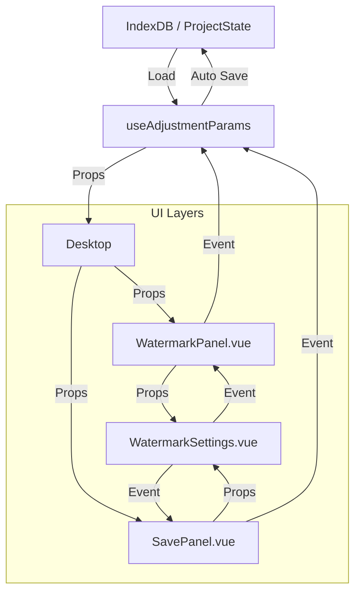

# 水印模块重构方案 (2026-01-20)

## 1. 问题诊断

当前项目中存在独立水印面板 (`WatermarkPanel.vue`) 和保存面板中的水印设置 (`WatermarkSettings.vue`) 两套实现，存在以下严重问题：

1.  **代码冗余**: 两者重复实现了文本输入、样式切换、滑块调节等基础 UI 逻辑。
2.  **UI/UX 不一致**:
    *   `WatermarkPanel`: 使用了项目标准的 `Slider` 组件，包含颜色选择器，体验较好。
    *   `WatermarkSettings`:使用了原生 `<input type="range">`，样式简陋，且**缺失颜色选择功能**。
3.  **状态管理冲突**:
    *   `WatermarkPanel`: 为**受控组件**，正确接收 `props.watermarkConfig`，反映当前项目状态。
    *   `WatermarkSettings`: 内部独立维护 `当前配置` 状态，初始化时仅加载默认值，**导致保存面板打开时无法显示当前项目已有的水印参数**，且修改后可能意外覆盖原有设置。
4.  **功能割裂**: 预设管理功能 (`Presets`) 仅存在于 `WatermarkSettings` 中，主面板无法使用预设。

## 2. 重构目标

统一水印配置组件，实现"一次开发，处处复用"，确保 UI、功能和状态的一致性。

## 3. 详细实施方案

### 3.1 核心组件重构 (`WatermarkSettings.vue`)

将 `WatermarkSettings.vue` 升级为全功能的通用配置组件，作为单一事实来源。

*   **API 变更**:
    *   新增 Props: `config: 水印配置` (必需，实现受控模式)。
    *   移除内部独立的 `当前配置` 状态初始化逻辑，改为直接响应 `props.config`。
*   **UI 升级**:
    *   移植 `WatermarkPanel` 中的 `Slider` 组件实现，替代原生 Range Input。
    *   移植 `WatermarkPanel` 中的颜色选择器逻辑。
    *   保留原有的预设管理功能，但应用预设时改为触发 `update` 事件通知父组件变更。
*   **逻辑优化**:
    *   删除 `WatermarkSettings.ctx.ts` 中维护独立状态的逻辑，改为纯函数工具库（仅保留预设的增删改查逻辑）。

### 3.2 独立面板通过引用重构 (`WatermarkPanel.vue`)

大幅精简 `WatermarkPanel.vue` 代码，使其成为 `WatermarkSettings` 的轻量封装容器。

*   **修改内容**:
    *   删除所有滑块、输入框、颜色选择器的 HTML 和逻辑。
    *   引入 `<WatermarkSettings :config="watermarkConfig" @change="..." />`。
    *   保留最外层的 "Enable Watermark" 开关（这是面板层级的控制，而非配置层级）。

### 3.3 保存面板对接修复 (`SavePanel.vue`)

修复保存面板中的状态断裂问题。

*   **修改内容**:
    *   为 `<WatermarkSettings />` 传入当前项目的实际水印配置（需从 `useTextureState` 或 `props` 中获取）。
    *   确保在保存面板修改水印参数时，能实时同步回项目状态，保证所见即所得。

## 4. 数据流图 (Refactoring)

## 5. 执行计划

1.  **备份**: 备份现有 `WatermarkSettings.vue` 和 `WatermarkPanel.vue`。
2.  **升级 Settings**: 改造 `WatermarkSettings.vue`，集成 Slider 和 ColorPicker，改为受控模式。
3.  **集成 Main**: 重构 `WatermarkPanel.vue` 使用新组件。
4.  **集成 Save**: 更新 `SavePanel.vue` 传递正确 Props。
5.  **验证**: 测试主面板和保存面板的参数是否双向同步，预设功能是否在两处均可用。
