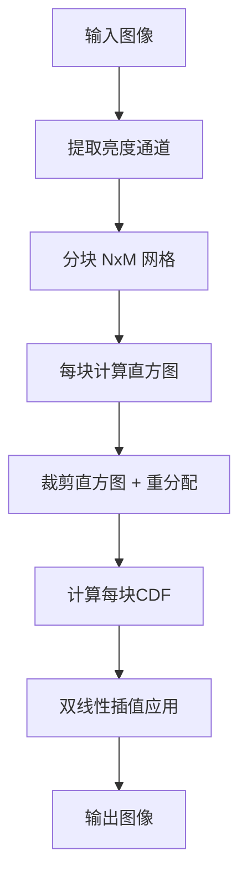

# 自动曝光分析多先验支持

## 问题背景

当前自动曝光分析只使用单一的 CDF 映射算法，缺乏灵活性。用户希望能够选择不同的先验/算法以适应不同场景。

## 算法对比

| 方法 | 适用场景 | 特点 | GPU友好度 |
|------|----------|------|-----------|
| **直方图均衡化 (HE)** | 低对比度图像 | 全局处理，简单快速 | ⭐⭐⭐ |
| **CLAHE** | 局部对比度不均 | 分块自适应，防止过度增强 | ⭐⭐⭐ |
| **自适应伽马校正** | 暗部/亮部细节恢复 | 基于亮度自动调整伽马值 | ⭐⭐⭐ |
| **CDF 色调映射** | 通用曝光校正 | 当前实现 | ⭐⭐ |
| **场景分类补偿** | 逆光/过曝场景 | 先判断场景类型再针对性调整 | ⭐⭐ |

## CLAHE 算法详解

**CLAHE (Contrast Limited Adaptive Histogram Equalization)** 是限制对比度的自适应直方图均衡化算法，通过分块处理避免全局均衡化的过度增强问题。

### 算法流程



### GPU 实现方案 (3-Pass)

假设已有 WebGPU 排序/前缀和实现。

#### Pass 1: 分块直方图计算

```wgsl
// 每个工作组处理一个 tile，使用原子操作累加直方图
@compute @workgroup_size(16, 16)
fn 计算分块直方图(@builtin(global_invocation_id) gid: vec3<u32>) {
    let tileX = gid.x / tileWidth;
    let tileY = gid.y / tileHeight;
    let tileIdx = tileY * tilesX + tileX;
    
    let luminance = 获取亮度(gid.xy);
    let bin = u32(luminance * 255.0);
    
    // 原子累加到对应 tile 的直方图
    atomicAdd(&histograms[tileIdx * 256 + bin], 1u);
}
```

#### Pass 2: 直方图裁剪 + CDF 计算

```wgsl
// 每个工作组处理一个 tile 的直方图
@compute @workgroup_size(256)
fn 裁剪并计算CDF(@builtin(workgroup_id) wgid: vec3<u32>) {
    let tileIdx = wgid.x;
    let bin = local_invocation_id.x;
    
    // 1. 读取直方图值
    var count = histograms[tileIdx * 256 + bin];
    
    // 2. 裁剪超过限制的部分
    let excess = max(0, i32(count) - clipLimit);
    count = min(count, clipLimit);
    
    // 3. 重分配 excess（简化版：均匀分配）
    let redistrib = atomicAdd(&totalExcess[tileIdx], excess) / 256u;
    count += redistrib;
    
    // 4. 计算 CDF（使用前缀和）
    // 假设有 prefixSum 工具函数
    cdf[tileIdx * 256 + bin] = prefixSum(count, bin);
}
```

#### Pass 3: 双线性插值应用

```wgsl
@compute @workgroup_size(16, 16)
fn 应用CLAHE(@builtin(global_invocation_id) gid: vec3<u32>) {
    let uv = vec2<f32>(gid.xy) / vec2<f32>(imageSize);
    
    // 找到最近的4个 tile 中心
    let tileUV = uv * vec2<f32>(tilesX, tilesY) - 0.5;
    let t0 = vec2<u32>(floor(tileUV));
    let t1 = min(t0 + 1, vec2<u32>(tilesX-1, tilesY-1));
    
    // 插值权重
    let w = fract(tileUV);
    
    // 从4个 tile 的 CDF 中查询映射值
    let luminance = 获取亮度(gid.xy);
    let bin = u32(luminance * 255.0);
    
    let v00 = cdf[getTileIdx(t0.x, t0.y) * 256 + bin];
    let v10 = cdf[getTileIdx(t1.x, t0.y) * 256 + bin];
    let v01 = cdf[getTileIdx(t0.x, t1.y) * 256 + bin];
    let v11 = cdf[getTileIdx(t1.x, t1.y) * 256 + bin];
    
    // 双线性插值
    let result = mix(mix(v00, v10, w.x), mix(v01, v11, w.x), w.y);
    
    输出像素(gid.xy, result);
}
```

### 关键参数

| 参数 | 默认值 | 说明 |
|------|--------|------|
| `tileSize` | 64x64 | 分块大小，越小局部对比度越强 |
| `clipLimit` | 2.0 | 裁剪限制，值越小抑制噪声越强 |
| `tilesX/Y` | 自动 | 水平/垂直分块数 |

## Proposed Changes

### 曝光调整模块

#### [NEW] [clahe.code.ts](file:///d:/dev/seamless-texture-generator/demo/src/adjustments/exposure/clahe.code.ts)

CLAHE 的 WGSL 着色器代码（3个 pass）。

#### [NEW] [clahe.gpu.ts](file:///d:/dev/seamless-texture-generator/demo/src/adjustments/exposure/clahe.gpu.ts)

CLAHE GPU 执行器，管理 3-pass 管线。

#### [MODIFY] [exposureAdjustment.types.ts](file:///d:/dev/seamless-texture-generator/demo/src/adjustments/exposure/exposureAdjustment.types.ts)

```typescript
type AutoExposureMode = 'cdf' | 'histogram_eq' | 'clahe' | 'adaptive_gamma'

interface CLAHEParams {
    tileSize: number      // 分块大小 (8-128)
    clipLimit: number     // 裁剪限制 (1.0-10.0)
}
```

#### [MODIFY] [autoExposureNode.ts](file:///d:/dev/seamless-texture-generator/demo/src/processPipelines/nodes/autoExposureNode.ts)

从 `options.exposureMode` 读取模式，调用对应算法。

### UI 组件

#### [MODIFY] [ExposurePanel.vue](file:///d:/dev/seamless-texture-generator/demo/src/components/control-panels/ExposurePanel.vue)

- 添加模式选择下拉框
- CLAHE 模式时显示额外参数（tileSize, clipLimit）

## Verification Plan

1. 加载低对比度图片，切换到 CLAHE 模式验证局部对比度增强
2. 调整 clipLimit 参数，观察噪声抑制效果
3. 调整 tileSize 参数，观察局部/全局效果变化
4. 性能测试：1920x1080 图片应在 50ms 内完成

